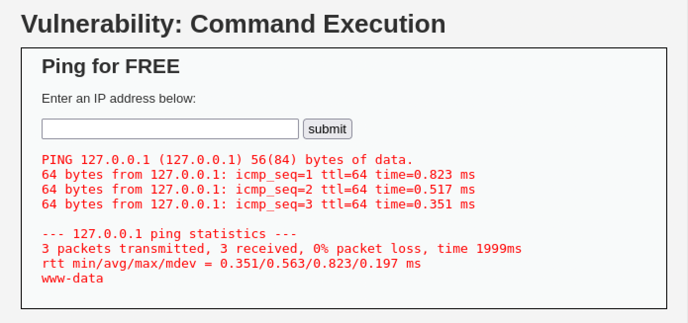

# Command Injection

**Severity:** Critical
**CVSS v3.1:** 9.8 (AV:N/AC:L/PR:N/UI:N/S:U/C:H/I:H/A:H)
**CWE:** CWE-78: Improper Neutralization of Special Elements used in an OS Command
**OWASP Top 10:** A03:2021 Injection

---

## Description
The application passes user-supplied input directly to a system shell without validation or sanitization, allowing arbitrary operating system commands to be executed on the server.

## Environment
- **Target:** Metasploitable 2 / DVWA (Security: Low)
- **Module:** DVWA > Command Execution
- **Tool:** Browser

## Proof of Concept

The Command Execution module is intended to ping a user-supplied IP address. By appending a shell command with `;`, the ping is chained with an arbitrary command.

**Payload:**
```
127.0.0.1; whoami
```

**Result:**
The ping output was returned, followed by the output of `whoami`, confirming that the injected command executed as the web server user:
```
www-data
```



## Business Impact
An attacker can execute arbitrary OS commands with the privileges of the web server process. This enables:
- Remote command execution and full server compromise
- Reading sensitive files and exfiltrating data
- Establishing a reverse shell for persistent access
- Lateral movement and privilege escalation

## Root Cause
User input is concatenated directly into a shell command (e.g. via `system()` / `shell_exec()`) with no input validation, no allowlisting, and no use of a safe API.

## Remediation
- Never pass user input to a system shell. Use language-native libraries instead of shelling out.
- If a command must be run, use parameterized APIs that separate the command from its arguments.
- Apply strict input allowlisting (e.g. validate that input is a well-formed IP address).
- Run the web server under a least-privilege account.

**References:**
- OWASP: https://owasp.org/www-community/attacks/Command_Injection
- CWE-78: https://cwe.mitre.org/data/definitions/78.html
