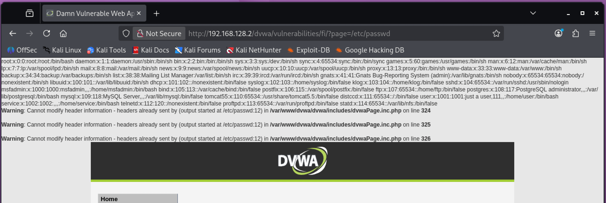

# Local File Inclusion (LFI)

**Severity:** High
**CVSS v3.1:** 7.5 (AV:N/AC:L/PR:N/UI:N/S:U/C:H/I:N/A:N)
**CWE:** CWE-98: Improper Control of Filename for Include/Require Statement
**OWASP Top 10:** A01:2021 Broken Access Control

---

## Description
The application includes files based on a user-controlled parameter without validation, allowing an attacker to read arbitrary files on the server.

## Environment
- **Target:** Metasploitable 2 / DVWA (Security: Low)
- **Module:** DVWA > File Inclusion
- **Tool:** Browser

## Source Code Observation
The `page` parameter is passed straight to the include statement:
```php
$file = $_GET['page'];
```
No validation is performed on the requested path.

## Proof of Concept

**Absolute path inclusion (successful):**
```
?page=/etc/passwd
```
The contents of `/etc/passwd` were returned, disclosing Linux account information (usernames, UIDs, home directories, shells).

**Directory traversal (behaviour noted):**
```
?page=../../../../etc/passwd
```
The relative traversal did not resolve in this configuration, but the absolute-path inclusion above achieved the same result.



## Business Impact
- Disclosure of sensitive system files (`/etc/passwd`, config files, application source, credentials)
- Exposure of configuration files often containing database passwords and API keys
- Combined with log poisoning or an upload vector, LFI can be escalated to remote code execution

## Root Cause
User input is used directly in a file `include`/`require` with no allowlist and no path canonicalization.

## Remediation
- Never build include paths from user input. Map user choices to a fixed server-side **allowlist** of permitted files.
- If a filename must come from input, canonicalize the path and confirm it stays within an intended base directory.
- Disable `allow_url_include` and `allow_url_fopen` in PHP.
- Run the web server under a least-privilege account so sensitive files are not readable.

**References:**
- OWASP: https://owasp.org/www-community/attacks/Path_Traversal
- CWE-98: https://cwe.mitre.org/data/definitions/98.html
