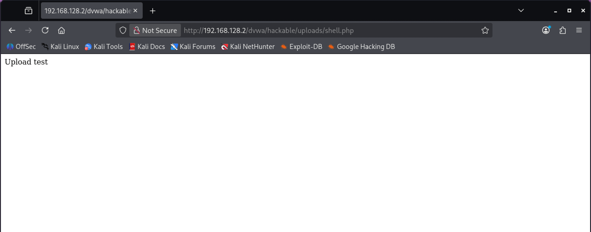

# Unrestricted File Upload

**Severity:** Critical
**CVSS v3.1:** 9.8 (AV:N/AC:L/PR:N/UI:N/S:U/C:H/I:H/A:H)
**CWE:** CWE-434 — Unrestricted Upload of File with Dangerous Type
**OWASP Top 10:** A04:2021 — Insecure Design

---

## Description
The application accepts file uploads without validating the file type, extension, or content, and stores them in a web-accessible directory where they can be executed by the server.

## Environment
- **Target:** Metasploitable 2 / DVWA (Security: Low)
- **Module:** DVWA > File Upload
- **Tool:** Browser

## Proof of Concept

A PHP file was created to test whether server-side script execution is possible:

**File — `shell.php`:**
```php
<?php echo "Upload test"; ?>
```

The file was uploaded through the DVWA File Upload module. The upload was accepted, and the file was reachable at:
```
http://192.168.128.2/dvwa/hackable/uploads/shell.php
```

**Result:** Browsing to that URL returned:
```
Upload test
```
confirming the uploaded PHP was executed by the server, not served as plain text.



## Business Impact
This is one of the highest-impact web vulnerabilities. A real attacker would upload a web shell instead of a test file, giving them:
- Remote code execution as the web server user
- Interactive control of the server through the browser
- A foothold for lateral movement, data theft, and ransomware deployment

## Root Cause
Missing controls on upload:
- No file extension validation (allowlist)
- No MIME-type verification
- No content inspection
- Uploads stored inside the web root with script execution enabled

## Remediation
- Validate uploads against a strict **allowlist** of permitted extensions and MIME types.
- Rename uploaded files to a random server-generated name and strip the original extension.
- Store uploads **outside the web root**, or in a location where script execution is disabled.
- Disable script execution in the upload directory (e.g. web server config, `php_admin_flag engine off`).
- Scan uploaded content and enforce size limits.

**References:**
- OWASP: https://owasp.org/www-community/vulnerabilities/Unrestricted_File_Upload
- CWE-434: https://cwe.mitre.org/data/definitions/434.html
