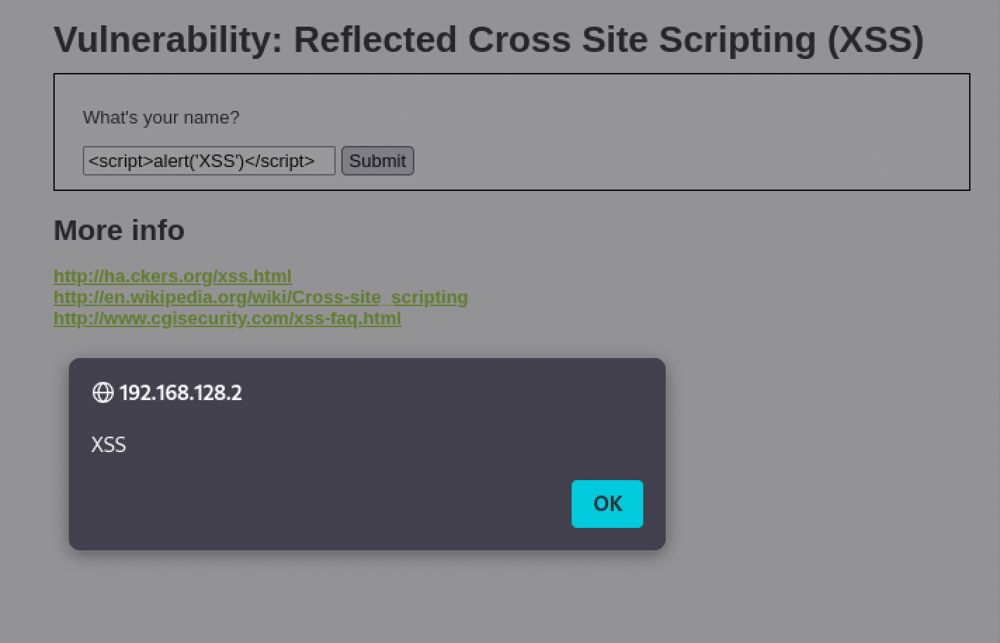

# Reflected Cross-Site Scripting (XSS)

**Severity:** Medium
**CVSS v3.1:** 6.1 (AV:N/AC:L/PR:N/UI:R/S:C/C:L/I:L/A:N)
**CWE:** CWE-79 — Improper Neutralization of Input During Web Page Generation
**OWASP Top 10:** A03:2021 — Injection

---

## Description
User input is reflected back into the page response without output encoding, allowing an attacker to inject JavaScript that executes in the victim's browser.

## Environment
- **Target:** Metasploitable 2 / DVWA (Security: Low)
- **Module:** DVWA > XSS (Reflected)
- **Tool:** Browser

## Proof of Concept

**Payload:**
```html
<script>alert('XSS')</script>
```

**Result:** The browser executed the injected JavaScript and displayed an alert box reading `XSS`, confirming that input is reflected into the page unencoded.



## Business Impact
Reflected XSS requires the victim to click a crafted link, but once triggered it runs in the victim's session and enables:
- Session cookie theft and account takeover
- Credential phishing via injected fake forms
- Redirection to malicious sites
- Actions performed as the victim

## Root Cause
User input is written into the HTML response without context-aware output encoding.

## Remediation
- Apply **context-aware output encoding** on all user-controlled data (HTML, attribute, JavaScript, URL contexts).
- Validate and sanitize input server-side.
- Deploy a **Content Security Policy (CSP)** to limit inline script execution.
- Set the `HttpOnly` flag on session cookies so they cannot be read by JavaScript.

**References:**
- OWASP: https://owasp.org/www-community/attacks/xss/
- CWE-79: https://cwe.mitre.org/data/definitions/79.html
