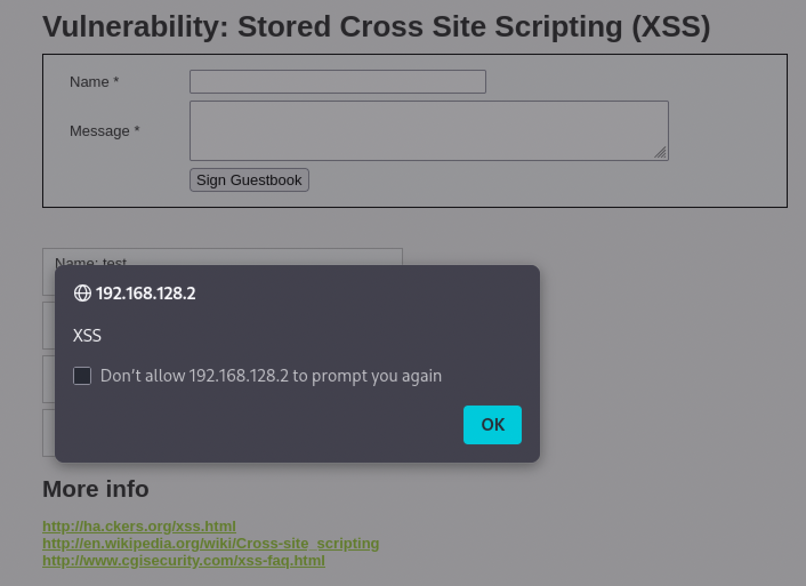

# Stored Cross-Site Scripting (XSS)

**Severity:** High
**CVSS v3.1:** 7.4 (AV:N/AC:L/PR:L/UI:R/S:C/C:H/I:L/A:N)
**CWE:** CWE-79 — Improper Neutralization of Input During Web Page Generation
**OWASP Top 10:** A03:2021 — Injection

---

## Description
User input is stored by the application (e.g. in a database) and later rendered to other users without output encoding. The injected script executes for every visitor who views the affected page.

## Environment
- **Target:** Metasploitable 2 / DVWA (Security: Low)
- **Module:** DVWA > XSS (Stored)
- **Tool:** Browser

## Proof of Concept

The payload was submitted into the stored guestbook/message field:

**Payload:**
```html
<script>alert('XSS')</script>
```

**Result:** The script was saved and executed automatically every time the page was loaded — no crafted link or victim interaction required.



## Reflected vs Stored — why Stored is worse
| | Reflected XSS | Stored XSS |
|---|---|---|
| Delivery | Victim must click a crafted link | Payload lives on the page |
| Reach | One victim per link | Every visitor to the page |
| Persistence | None | Persists until removed |

## Business Impact
Stored XSS is more dangerous than reflected because it needs no social engineering and affects all visitors. Impact includes mass session hijacking, worm-like propagation, defacement, and credential theft across the entire user base.

## Root Cause
User input is stored and later rendered into HTML without output encoding.

## Remediation
- Apply context-aware **output encoding** at render time (encode on output, not only on input).
- Sanitize stored input with a vetted library (e.g. server-side HTML sanitizer).
- Deploy a strict **Content Security Policy**.
- Set `HttpOnly` on session cookies.

**References:**
- OWASP: https://owasp.org/www-community/attacks/xss/
- CWE-79: https://cwe.mitre.org/data/definitions/79.html
