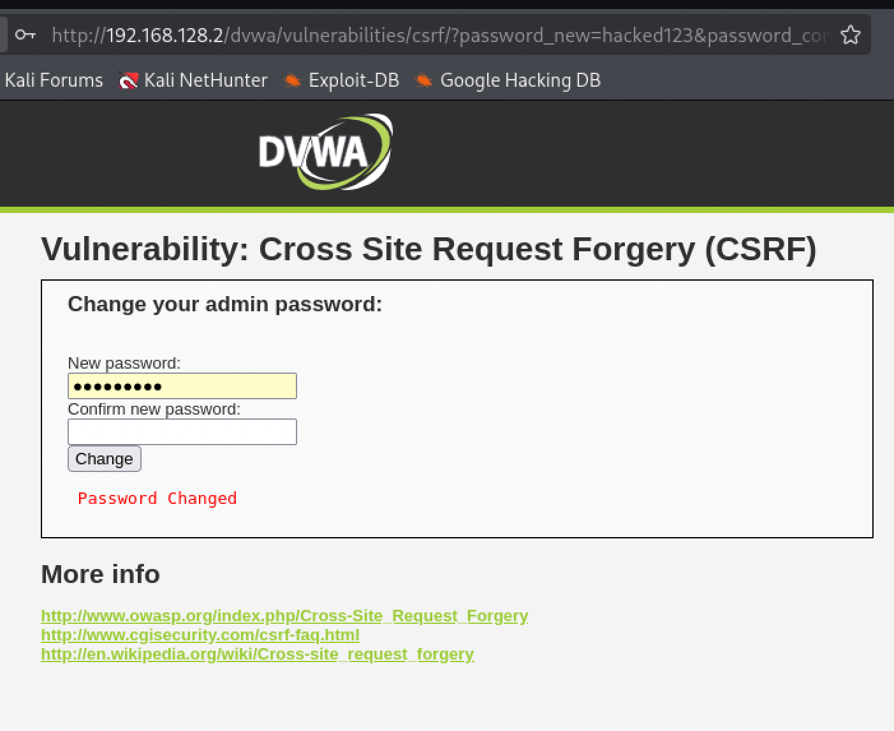

# Cross-Site Request Forgery (CSRF)

**Severity:** Medium
**CVSS v3.1:** 6.5 (AV:N/AC:L/PR:N/UI:R/S:U/C:N/I:H/A:N)
**CWE:** CWE-352: Cross-Site Request Forgery
**OWASP Top 10:** A01:2021 Broken Access Control

---

## Description
A sensitive state-changing action (password change) is performed based only on the authenticated session, with no unpredictable token to prove the request was intentional. An attacker can therefore forge the request from another site.

## Environment
- **Target:** Metasploitable 2 / DVWA (Security: Low)
- **Module:** DVWA > CSRF
- **Tool:** Browser

## Proof of Concept

The DVWA password-change function accepts a simple GET/POST request with no anti-CSRF token:
```
GET /vulnerabilities/csrf/?password_new=hacked&password_conf=hacked&Change=Change
```

Submitting this request while authenticated changed the account password successfully. Because there is no token, the identical request could be triggered from an attacker-controlled page (e.g. a hidden image or auto-submitting form) while the victim is logged in.

**Result:** Password changed with no additional verification.



## Business Impact
An attacker can force a logged-in user to perform unwanted actions such as changing their password (account takeover), changing their email, transferring funds, or modifying settings, simply by getting them to load a malicious page while their session is active.

## Root Cause
State-changing requests are authenticated only by the ambient session cookie, which the browser sends automatically. There is no per-request anti-CSRF token and no re-authentication.

## Remediation
- Implement **anti-CSRF tokens** (unique, unpredictable, per-session or per-request) on all state-changing requests.
- Set session cookies to **`SameSite=Strict`** (or `Lax`).
- Require **re-authentication** for sensitive actions like password change.
- Do not use GET for state-changing operations.

**References:**
- OWASP: https://owasp.org/www-community/attacks/csrf
- CWE-352: https://cwe.mitre.org/data/definitions/352.html
