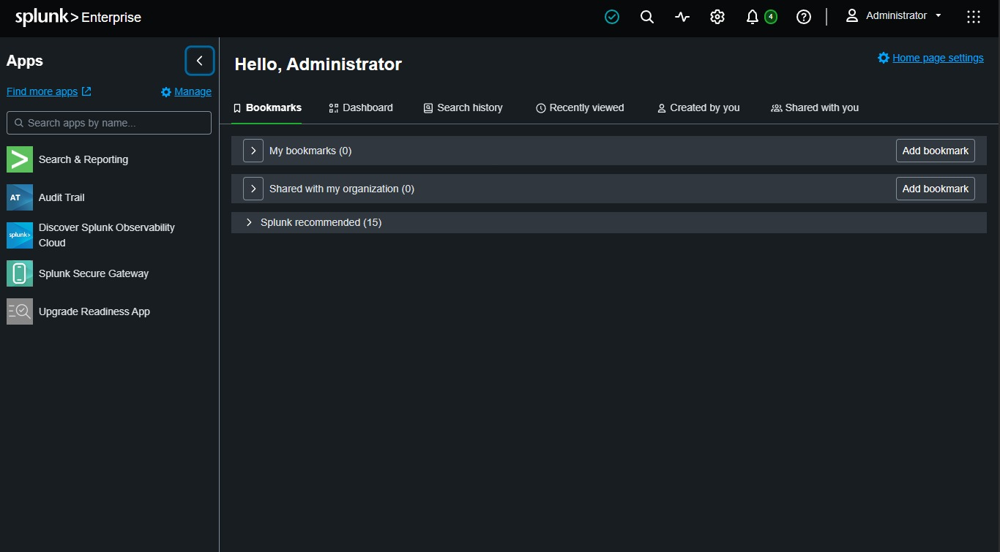
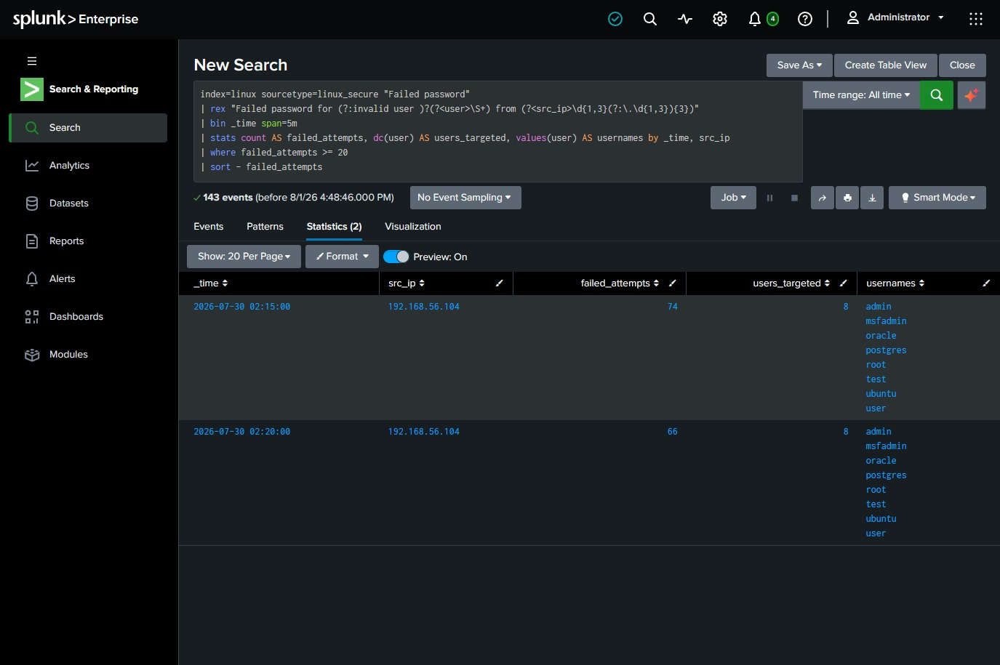
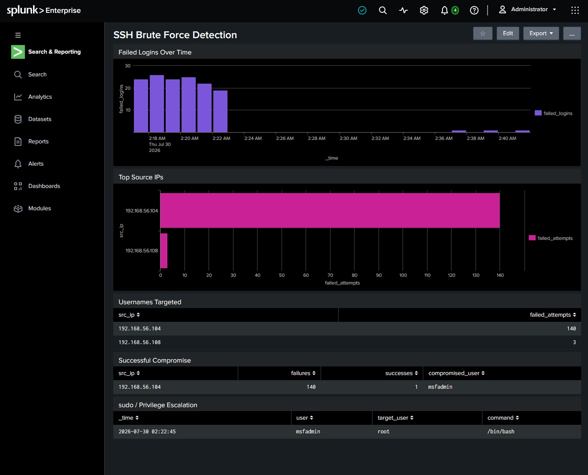
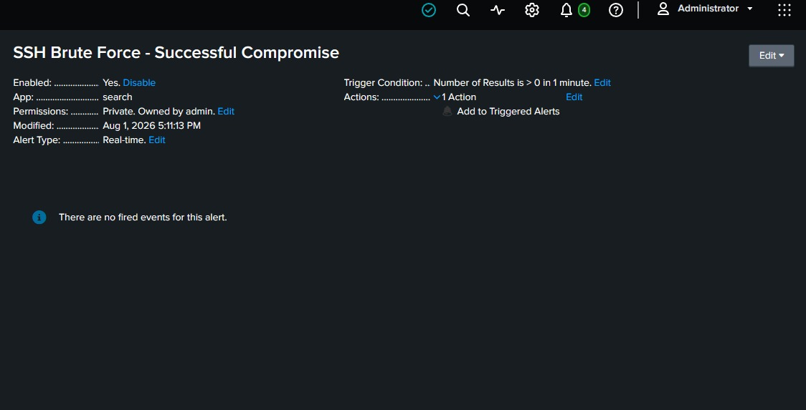

# Detection 01: SSH Brute Force & Successful Compromise

**Portfolio Project | Splunk SIEM | SOC / Incident Response**
Author: [Your Name] · Lab: Home SOC (Splunk Enterprise) · Date: 2026-07-30

---

## Detection Name
SSH Brute Force Attempt Followed by Successful Authentication

## Objective
Detect a high volume of failed SSH password attempts from a single source IP against a Linux host, and, most importantly, identify when that same IP subsequently succeeds in authenticating. A successful login after a brute-force burst is the difference between a *blocked attack* and an *active compromise*, and it is what turns this from an alert into an incident.

## Data Source
- **Log file:** `/var/log/auth.log` (Debian/Ubuntu/Kali) or `/var/log/secure` (RHEL/CentOS)
- **Producer:** `sshd` (OpenSSH daemon) and `pam_unix`
- **Splunk sourcetype:** `linux_secure`
- **Index:** `linux` (or `main` for the lab)

## Key Event Types
| Meaning | Log signature |
|---|---|
| Failed login | `Failed password for <user> from <ip>` |
| PAM auth failure | `pam_unix(sshd:auth): authentication failure ... rhost=<ip>` |
| Successful login | `Accepted password for <user> from <ip>` |
| Privilege escalation | `sudo: <user> : ... USER=root ; COMMAND=` |

---

## SPL Query: Core Detection

```spl
index=linux sourcetype=linux_secure "Failed password"
| rex "Failed password for (?:invalid user )?(?<user>\S+) from (?<src_ip>\d{1,3}(?:\.\d{1,3}){3})"
| bin _time span=5m
| stats count AS failed_attempts,
        dc(user) AS users_targeted,
        values(user) AS usernames
        by _time, src_ip
| where failed_attempts >= 20
| sort - failed_attempts
```

**What it does:** buckets failed logins into 5-minute windows per source IP, counts attempts and how many distinct usernames were sprayed, then flags any IP with 20+ failures in a window. `dc(user)` catches username spraying (a single IP trying `root`, `admin`, `oracle`...), a strong brute-force signal.

## SPL Query: The Important One: Success After Failure

```spl
index=linux sourcetype=linux_secure (src_ip=* OR "Failed password" OR "Accepted password")
| rex "Failed password for (?:invalid user )?(?<f_user>\S+) from (?<src_ip>\d{1,3}(?:\.\d{1,3}){3})"
| rex "Accepted password for (?<s_user>\S+) from (?<src_ip>\d{1,3}(?:\.\d{1,3}){3})"
| eval outcome=if(isnotnull(f_user),"failed","success")
| stats count(eval(outcome="failed"))  AS failures,
        count(eval(outcome="success")) AS successes,
        values(s_user) AS compromised_user,
        earliest(_time) AS first_seen,
        latest(_time)   AS last_seen
        by src_ip
| where failures >= 20 AND successes >= 1
| eval first_seen=strftime(first_seen,"%F %T"), last_seen=strftime(last_seen,"%F %T")
| sort - failures
```

**What it does:** correlates both outcomes per source IP. An IP with **≥20 failures AND ≥1 success** is a likely successful brute force → treat as a confirmed incident. `compromised_user` names the account that was breached.

## Detecting the Follow-On Privilege Escalation

```spl
index=linux sourcetype=linux_secure "sudo:" "COMMAND="
| rex "sudo:\s+(?<user>\S+)\s+:.*USER=(?<target_user>\S+)\s+;\s+COMMAND=(?<command>.*)"
| table _time, user, target_user, command
| sort _time
```

Run this scoped to the compromised account after a confirmed success to see what the attacker did post-access (e.g. `msfadmin` escalating to `root`).

---

## Explanation (Why This Works)
SSH brute forcing is noisy by nature: valid users mistype a password once or twice, but an attacker generates dozens to thousands of failures in minutes. Thresholding failures per source IP over a short window separates a fat-fingered user from an attack. The high-value refinement is the **success-after-failure correlation**, a lone spike of failures may be a blocked attack, but a spike *immediately followed by an accepted login from the same IP* means the attacker guessed valid credentials and you now have an active intrusion. Layering in the `sudo`/privilege-escalation query gives you the attacker's post-compromise actions, which is what an incident responder actually reports on.

## MITRE ATT&CK Mapping
| Tactic | Technique | ID |
|---|---|---|
| Credential Access | Brute Force: Password Guessing | **T1110.001** |
| Credential Access | Brute Force: Credential Stuffing | T1110.004 |
| Initial Access / Persistence | Valid Accounts | **T1078** |
| Lateral Movement | Remote Services: SSH | T1021.004 |
| Privilege Escalation | Abuse Elevation Control: Sudo | **T1548.003** |

## Severity
| Scenario | Severity |
|---|---|
| Failures only, no success (attack blocked) | **Medium** |
| Failures + successful login from same IP | **High → Critical** |
| Success + privilege escalation to root | **Critical** |

Rationale: brute force alone is an attempted intrusion (Medium). A successful authentication from a brute-forcing IP is confirmed unauthorized access (High/Critical depending on account privilege).

---

## Triage Steps (First 10 Minutes)
1. **Confirm it's real, not noise.** Check the source IP, is it internal, a known scanner, or external/unknown? One IP hitting many usernames = attack, not a locked-out user.
2. **Check for success.** Run the success-after-failure query. No success → attempted intrusion. Success → escalate to incident immediately.
3. **Identify the account.** Which user was accepted? Is it a privileged/service account (`root`, `msfadmin`, `postgres`)?
4. **Scope the timeline.** `first_seen` → `last_seen` gives attack duration and the moment of compromise.

## Investigation
- Pull all events for the source IP: `index=linux src_ip="192.168.56.104" | sort _time`.
- Determine the compromised account and whether the login was interactive (`session opened`).
- Look for post-compromise activity from that user: `sudo`, new SSH sessions outward, file changes, new cron jobs, added users.
- Check whether the same IP or credential appears against other hosts (lateral movement).
- Geolocate / reputation-check the external IP if applicable.

## Containment
- Block the source IP at the host/perimeter firewall (`iptables`/security group).
- Disable or force a password reset on the compromised account.
- Kill active sessions for that user (`pkill -u <user>`); review `who`/`last`.
- Preserve `/var/log/auth.log` and relevant artifacts for evidence before remediation.
- If root was reached, treat the host as fully compromised → rebuild rather than clean.

## Recommendations (Hardening)
- Enforce **key-based SSH auth** and set `PasswordAuthentication no`.
- Deploy **fail2ban** to auto-ban IPs after N failures.
- Restrict SSH exposure (VPN/bastion, allowlist source IPs, non-default port is cosmetic but reduces noise).
- Disable direct `root` login (`PermitRootLogin no`).
- Enforce strong password policy + MFA where possible.
- Alerting: schedule the success-after-failure query as a Splunk alert (below).

---

## Save as a Scheduled Alert
1. Run the **Success After Failure** SPL in Search.
2. **Save As → Alert.**
3. Trigger: *Number of Results* > 0. Schedule: every 5 minutes over a 5-minute window (or real-time for the lab).
4. Action: add to Triggered Alerts (and email/webhook in production).
5. Name it `SSH Brute Force - Successful Compromise` and set severity High.

## Dashboard Panels to Build
- **Failed logins over time**: timechart of failures (spot the burst visually).
- **Top source IPs by failed attempts**: bar chart.
- **Usernames targeted**: table with `dc(user)`.
- **Success-after-failure**: the incident table (the money panel).
- **Post-compromise sudo activity**: command table.

---

## Resume Bullet
> Built an SSH brute-force detection in Splunk (SPL) against Linux `auth.log`, correlating failed and successful authentications per source IP to distinguish blocked attacks from confirmed compromises; mapped to MITRE ATT&CK T1110/T1078/T1548 and packaged full triage-to-containment incident documentation and a scheduled alert.

## Interview Explanation (say this out loud)
> "I ingested Linux `auth.log` into Splunk as `linux_secure` and wrote SPL to threshold failed SSH logins per source IP over a 5-minute window, twenty-plus failures from one IP, especially spraying multiple usernames, is a brute-force signature. But the detection I actually care about is the correlation query: I count failures and successes per IP, and if one IP has many failures *and* an accepted login, that's no longer an attempted attack, it's a confirmed compromise, and I escalate it to an incident. From there I identify the breached account, pull the timeline with earliest/latest, check for `sudo` privilege escalation to see what the attacker did with the access, and move into containment: block the IP, reset the account, preserve logs. I mapped it to MITRE T1110.001 for the brute force and T1078 for the valid-account access, and saved it as a scheduled alert."

---

## Evidence Checklist (screenshots to capture)
- [ ] Splunk showing ingested `auth.log` events (`index=linux sourcetype=linux_secure`)
- [ ] Core detection query with the flagged source IP
- [ ] Success-after-failure query showing the compromise + `compromised_user`
- [ ] Timechart panel of the failure burst
- [ ] `sudo` privilege-escalation result
- [ ] Saved alert configuration screen


---

## Evidence (Splunk screenshots)
> Detections were built and proven against sample log data; the SSH attack is additionally reproduced live with Hydra (see `02_Hydra_Live_Attack_Reproduction.md`).

**1.** Splunk Home (Search & Reporting app).



**2.** Dedicated `linux` index created for the auth telemetry.


**3.** `auth.log` ingested via Add Data (sourcetype `linux_secure`).


**4.** `index=linux` returning the 288 ingested events.


**5.** Brute-force detection: 192.168.56.104 with 148 failed attempts across multiple usernames.



**6.** Success-after-failure correlation: 148 failures + 1 success = `msfadmin` compromised (the incident).


**7.** SSH Brute Force Detection dashboard.



**8.** Saved scheduled alert: 'SSH Brute Force - Successful Compromise' (High severity).


