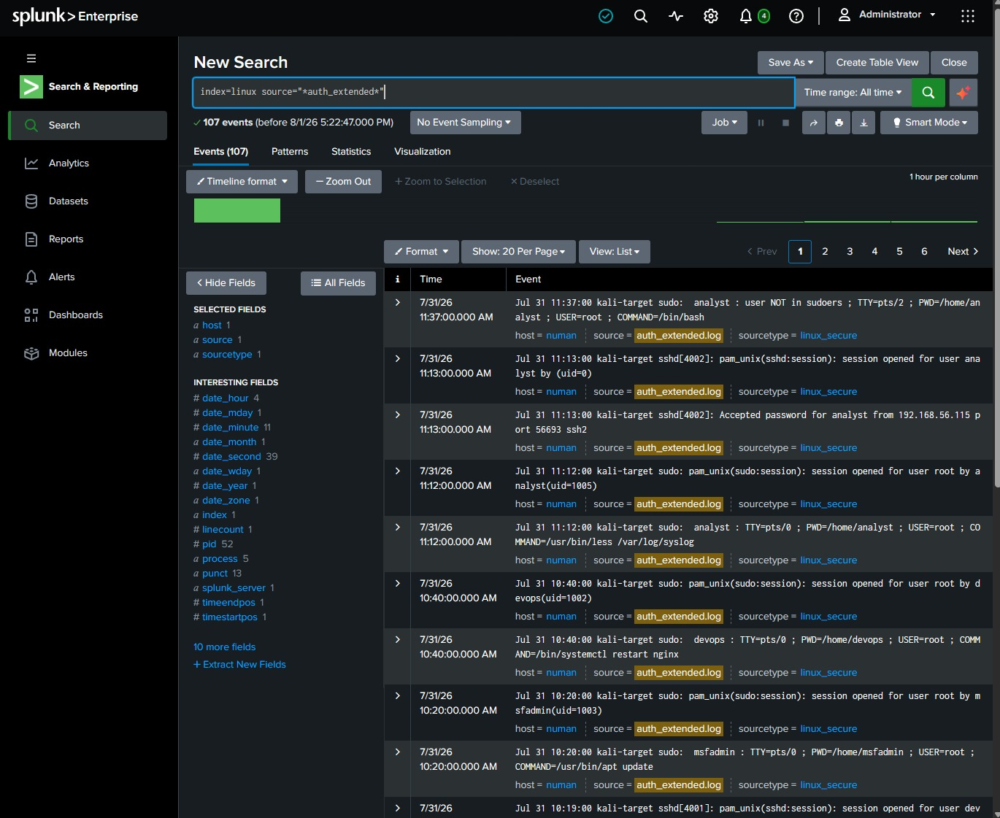
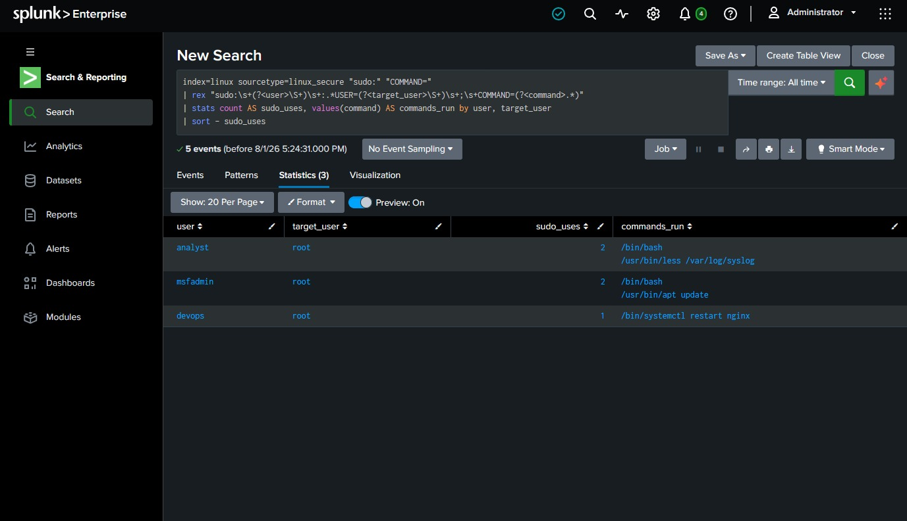
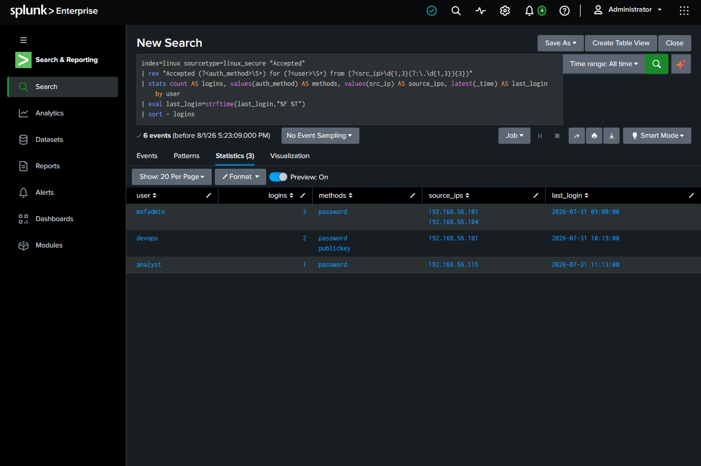
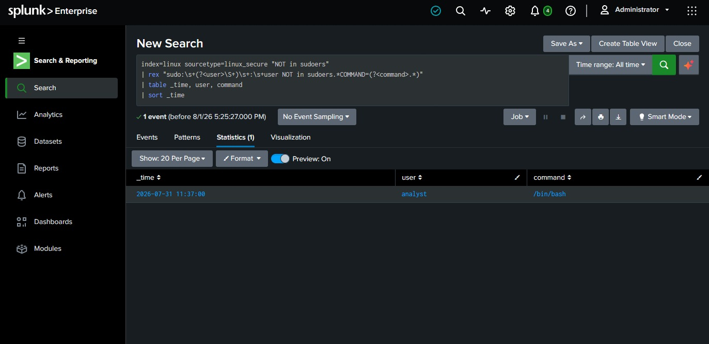
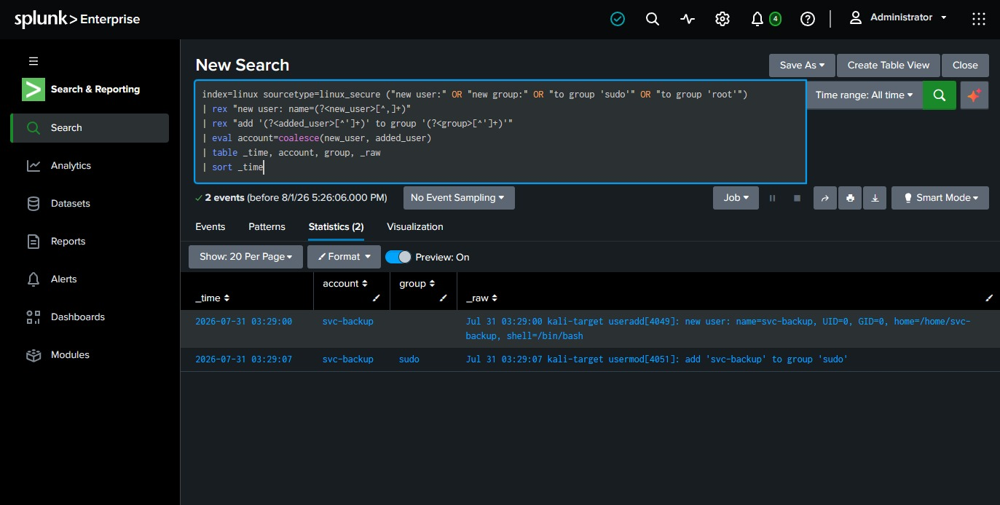
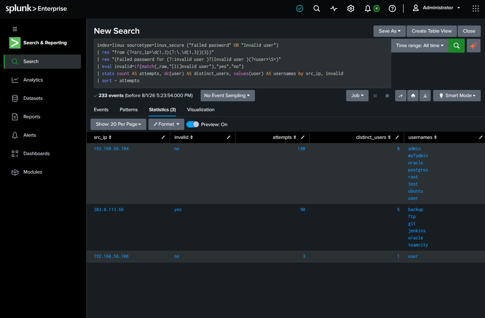
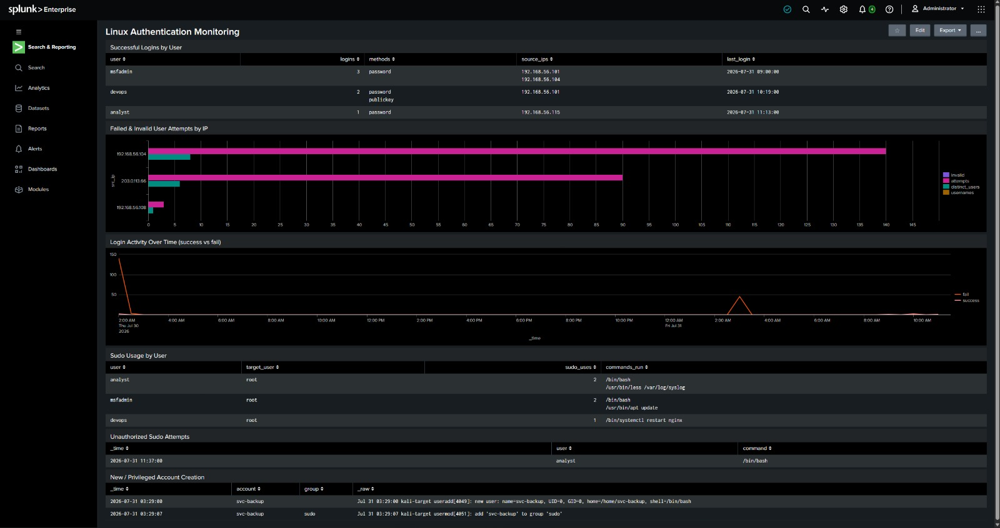
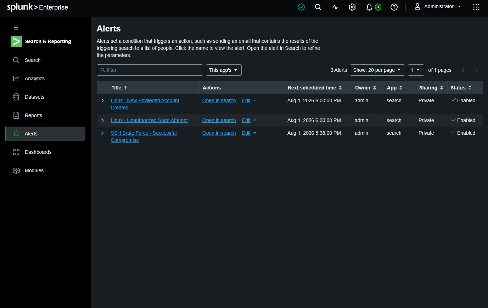
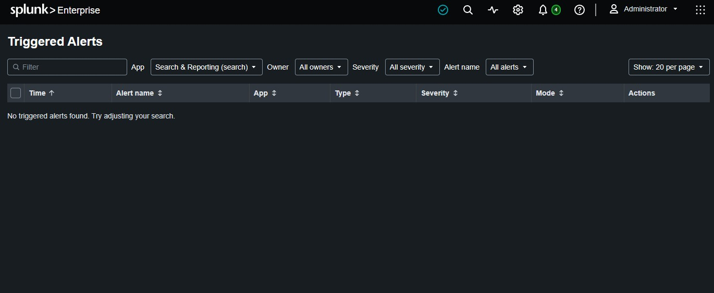

# Detection 03: Linux Authentication Monitoring

**Portfolio Project | Splunk SIEM | SOC / Incident Response**
Author: [Your Name] · Lab: Home SOC (Splunk Enterprise) · Date: 2026-07-31

> Reuses your existing `linux` index and `linux_secure` sourcetype. No new ingestion setup, you just add one more file and write new SPL.

---

## What This Project Is
Where Project #1 hunted one specific attack (SSH brute force), this project builds **broad authentication monitoring**, the everyday baseline a SOC analyst watches: who logged in, who failed, who used sudo, who escalated to root, and whether any new accounts appeared. It's less about a single alert and more about *visibility*. In the Deloitte IR role this maps to "Windows/Linux logs," "security investigations," and "alert triage", you're demonstrating you can turn raw auth logs into monitored security signal.

---

## Step 0: Add the Extended Sample Data
1. In Splunk: **Settings → Add Data → Upload**.
2. Select **`auth_extended.log`**, click **Next**.
3. Source type = **`linux_secure`**, click **Next**.
4. Index = **`linux`** (same index as before), click **Review → Submit → Start Searching**.
5. Confirm: search `index=linux source="*auth_extended*"` with time range **All time**. You should see ~107 new events.

📸 **CHECKPOINT 1:** screenshot the search showing `auth_extended.log` events ingested.

> You now have two files in the `linux` index. That's realistic, a SIEM aggregates many sources into one index. Every query below still just starts with `index=linux`.

---

## Detection 3.1: Successful Logins (Who Got In)
**Objective:** baseline all successful authentications, user, source IP, and method (password vs key).

```spl
index=linux sourcetype=linux_secure "Accepted"
| rex "Accepted (?<auth_method>\S+) for (?<user>\S+) from (?<src_ip>\d{1,3}(?:\.\d{1,3}){3})"
| stats count AS logins, values(auth_method) AS methods, values(src_ip) AS source_ips, latest(_time) AS last_login by user
| eval last_login=strftime(last_login,"%F %T")
| sort - logins
```
**Read it:** every user who successfully logged in, how, from where, and when last. A service account suddenly logging in interactively, or a user from an unexpected IP, jumps out here.
**MITRE:** T1078 Valid Accounts.

📸 **CHECKPOINT 2:** screenshot the successful-logins table.

## Detection 3.2: Failed Logins & Invalid Users
**Objective:** surface failed auth and, critically, logins to **usernames that don't exist** (`invalid user`), a hallmark of automated scanning, not a real user mistyping.

```spl
index=linux sourcetype=linux_secure ("Failed password" OR "Invalid user")
| rex "from (?<src_ip>\d{1,3}(?:\.\d{1,3}){3})"
| rex "(Failed password for (?:invalid user )?|Invalid user )(?<user>\S+)"
| eval invalid=if(match(_raw,"[Ii]nvalid user"),"yes","no")
| stats count AS attempts, dc(user) AS distinct_users, values(user) AS usernames by src_ip, invalid
| sort - attempts
```
**Read it:** an IP with many attempts and `invalid=yes` across many distinct usernames = credential scanning. In your data, `203.0.113.66` lights up at 3 AM hitting `oracle`, `jenkins`, `ftp`…
**MITRE:** T1110 Brute Force; T1589 Gather Victim Identity Info (username enumeration).

📸 **CHECKPOINT 3:** screenshot the invalid-user scan from `203.0.113.66`.

## Detection 3.3: Sudo / Privilege Escalation Usage
**Objective:** track every use of `sudo`, who ran what as whom. This is the single most important thing to monitor on a Linux host after login, because it's how a normal user becomes root.

```spl
index=linux sourcetype=linux_secure "sudo:" "COMMAND="
| rex "sudo:\s+(?<user>\S+)\s+:.*USER=(?<target_user>\S+)\s+;\s+COMMAND=(?<command>.*)"
| stats count AS sudo_uses, values(command) AS commands_run by user, target_user
| sort - sudo_uses
```
**Read it:** who is escalating and what they run. Admins running `apt update` is normal; `svc-backup` or a freshly-compromised account running `/bin/bash` as root is not.
**MITRE:** T1548.003 Sudo and Sudo Caching.

📸 **CHECKPOINT 4:** screenshot the sudo usage table.

## Detection 3.4: Unauthorized sudo Attempt (High Signal)
**Objective:** catch a user *trying* to sudo when they aren't allowed, a strong indicator of an attacker or insider probing for escalation.

```spl
index=linux sourcetype=linux_secure "NOT in sudoers"
| rex "sudo:\s+(?<user>\S+)\s+:\s+user NOT in sudoers.*COMMAND=(?<command>.*)"
| table _time, user, command
| sort _time
```
**Read it:** any hit is worth investigating. In your data, `analyst` tries to run `/bin/bash` as root and is denied.
**MITRE:** T1548.003 (attempted); T1078 Valid Accounts abuse.

📸 **CHECKPOINT 5:** screenshot the unauthorized sudo ("NOT in sudoers") result, this is a key one.

## Detection 3.5: New Account Creation (Persistence)
**Objective:** detect creation of new users/groups or additions to privileged groups, a classic persistence move so the attacker keeps access even after the original hole is closed.

```spl
index=linux sourcetype=linux_secure ("new user:" OR "new group:" OR "to group 'sudo'" OR "to group 'root'")
| rex "new user: name=(?<new_user>[^,]+)"
| rex "add '(?<added_user>[^']+)' to group '(?<group>[^']+)'"
| eval account=coalesce(new_user, added_user)
| table _time, account, group, _raw
| sort _time
```
**Read it:** in your data, `svc-backup` is created with **UID=0** (root-equivalent!) and added to the `sudo` group at 3:29 AM, right after the off-hours attack. That's textbook persistence.
**MITRE:** T1136.001 Create Account: Local Account; T1098 Account Manipulation.

📸 **CHECKPOINT 6:** screenshot the `svc-backup` UID=0 account creation, the centerpiece of this project.

---

## Severity Guide
| Signal | Severity |
|---|---|
| Normal successful login / routine sudo | Informational |
| Failed logins to invalid users (scanning) | Low–Medium |
| High-volume invalid-user attack | Medium |
| Unauthorized sudo attempt ("NOT in sudoers") | High |
| New privileged account / UID=0 user created | High–Critical |

## Triage Steps
1. **Anchor on the anomaly**, not the noise. Off-hours activity, invalid users, denied sudo, and new accounts are your priorities, routine daytime logins are baseline.
2. For a suspicious **source IP**, pivot: `index=linux src_ip="203.0.113.66" | sort _time` to see its full story (did scanning lead to a success?).
3. For a suspicious **account**, pivot on the user across all event types (login, sudo, creation).
4. Correlate timing, the new-user creation at 3:29 AM lines up with the 3:14 AM attack. Same actor, escalating.

## Investigation
- Was any invalid-user scan followed by a *successful* login from that IP? (Reuse the Project #1 success-after-failure query.)
- Who created `svc-backup`, and is that change authorized/ticketed? UID=0 is a giant red flag: no legitimate service account should share root's UID.
- What did newly-created or escalated accounts do afterward?
- Cross-check the source IP against threat intel / geolocation.

## Containment
- Disable/delete unauthorized accounts (`svc-backup`), remove from privileged groups.
- Reset credentials for any account showing anomalous access.
- Block the offending source IP.
- Audit `/etc/passwd`, `/etc/sudoers`, and cron for other persistence.
- Preserve logs before remediation.

## Recommendations
- Alert on **any** `NOT in sudoers` event and **any** new user with UID < 1000 or added to `sudo`/`root`.
- Enforce key-based SSH + `PermitRootLogin no` + fail2ban.
- Centralize logs off-host (forwarder) so an attacker can't wipe local evidence.
- Baseline normal login hours per user; alert on off-hours access for sensitive accounts.

---

## Building the Dashboard: Step by Step

You'll make a new dashboard called `Linux Authentication Monitoring` with 6 panels. **Panel 1 creates the dashboard (choose "New"). Panels 2–6 add to it (choose "Existing").** That one difference is the whole trick.

### The repeating recipe (same 5 clicks every time)
1. Go to the **Search** tab. Clear the search bar. Paste the panel's query.
2. Set the time picker (right of the bar) to **All time**. Click the green search button.
3. Choose the visualization:
   - For a **table**, click the **Statistics** tab (above the results). Nothing else needed.
   - For a **chart**, click the **Visualization** tab, then use the chart-type dropdown (top-left of that tab) to pick Column / Bar / Line.
4. Top-right: **Save As → Dashboard Panel**.
5. In the dialog: pick **New** (panel 1 only) or **Existing** (panels 2–6), set the Panel Title, click **Save**, then **View Dashboard**.

Now run it six times:

### Panel 1: "Successful Logins by User" · choose **NEW** dashboard · **Statistics** tab (table)
When the Save dialog opens: **Dashboard = New**, Dashboard Title = `Linux Authentication Monitoring`, Panel Title = `Successful Logins by User`, Dashboard Type = **Classic**, then **Save to Dashboard**.
```
index=linux sourcetype=linux_secure "Accepted"
| rex "Accepted (?<auth_method>\S+) for (?<user>\S+) from (?<src_ip>\d{1,3}(?:\.\d{1,3}){3})"
| stats count AS logins, values(auth_method) AS methods, values(src_ip) AS source_ips, latest(_time) AS last_login by user
| eval last_login=strftime(last_login,"%F %T")
| sort - logins
```

### Panel 2: "Failed / Invalid User Attempts by IP" · choose **EXISTING** · **Visualization** tab → **Bar Chart**
Save dialog: **Dashboard = Existing → Linux Authentication Monitoring**, Panel Title = `Failed & Invalid User Attempts by IP`.
```
index=linux sourcetype=linux_secure ("Failed password" OR "Invalid user")
| rex "from (?<src_ip>\d{1,3}(?:\.\d{1,3}){3})"
| rex "(Failed password for (?:invalid user )?|Invalid user )(?<user>\S+)"
| eval invalid=if(match(_raw,"[Ii]nvalid user"),"yes","no")
| stats count AS attempts, dc(user) AS distinct_users, values(user) AS usernames by src_ip, invalid
| sort - attempts
```

### Panel 3: "Login Activity Over Time" · **EXISTING** · **Visualization** tab → **Line Chart**
Panel Title = `Login Activity Over Time (success vs fail)`. This shows the 3 AM attack spike visually.
```
index=linux sourcetype=linux_secure ("Accepted" OR "Failed password")
| eval type=if(match(_raw,"Accepted"),"success","fail")
| timechart span=30m count by type
```

### Panel 4: "Sudo Usage" · **EXISTING** · **Statistics** tab (table)
Panel Title = `Sudo Usage by User`.
```
index=linux sourcetype=linux_secure "sudo:" "COMMAND="
| rex "sudo:\s+(?<user>\S+)\s+:.*USER=(?<target_user>\S+)\s+;\s+COMMAND=(?<command>.*)"
| stats count AS sudo_uses, values(command) AS commands_run by user, target_user
| sort - sudo_uses
```

### Panel 5: "⚠ Unauthorized Sudo Attempts" · **EXISTING** · **Statistics** tab (table)
Panel Title = `Unauthorized Sudo Attempts`.
```
index=linux sourcetype=linux_secure "NOT in sudoers"
| rex "sudo:\s+(?<user>\S+)\s+:\s+user NOT in sudoers.*COMMAND=(?<command>.*)"
| table _time, user, command
| sort _time
```

### Panel 6: "⚠ New Account Creation" · **EXISTING** · **Statistics** tab (table)
Panel Title = `New / Privileged Account Creation`. The money panel, shows `svc-backup` UID=0.
```
index=linux sourcetype=linux_secure ("new user:" OR "new group:" OR "to group 'sudo'" OR "to group 'root'")
| rex "new user: name=(?<new_user>[^,]+)"
| rex "add '(?<added_user>[^']+)' to group '(?<group>[^']+)'"
| eval account=coalesce(new_user, added_user)
| table _time, account, group, _raw
| sort _time
```

### Rearranging (optional)
Open the dashboard → **Edit** (top right) → drag panels to reorder, or drag a panel's edge to resize two side-by-side. Click **Save** when happy.

📸 **CHECKPOINT 7:** screenshot the full `Linux Authentication Monitoring` dashboard populated with all 6 panels.

---

## Saving the Alerts: Step by Step

You'll create **two** alerts. Same procedure for each; just different query, title, and severity.

### Alert 1: Unauthorized Sudo Attempt
1. Go to the **Search** tab. Paste the query, time picker **All time**, run it (you should see the `analyst` row):
   ```
   index=linux sourcetype=linux_secure "NOT in sudoers"
   | rex "sudo:\s+(?<user>\S+)\s+:\s+user NOT in sudoers.*COMMAND=(?<command>.*)"
   | table _time, user, command
   | sort _time
   ```
2. Top-right: **Save As → Alert**. A settings window opens.
3. Fill it in top to bottom:
   - **Title:** `Linux - Unauthorized Sudo Attempt`
   - **Description:** (optional) `Fires when a user tries sudo but is not in sudoers.`
   - **Permissions:** leave **Private** (fine for the lab).
   - **Alert type:** click **Scheduled** (not Real-time). A "Run every" dropdown appears → choose **Run every hour** (or *Run on Cron Schedule* if you want 5-min; hourly is fine for a lab).
   - **Trigger Conditions → Trigger alert when:** choose **Number of Results**, then set the operator to **is Greater than** and the value to **`0`**.
   - **Trigger:** leave **Once** (alert once per run, not per-result).
4. **Trigger Actions:** click **+ Add Actions** → select **Add to Triggered Alerts** → set **Severity: High**.
5. Click **Save**. Splunk shows the alert's summary page, click **View Alert** or **Continue Editing** as you like.

### Alert 2: New Privileged Account Created
Repeat the exact same steps with this query and these settings:
- **Query:**
  ```
  index=linux sourcetype=linux_secure ("new user:" OR "new group:" OR "to group 'sudo'" OR "to group 'root'")
  | rex "new user: name=(?<new_user>[^,]+)"
  | rex "add '(?<added_user>[^']+)' to group '(?<group>[^']+)'"
  | eval account=coalesce(new_user, added_user)
  | table _time, account, group, _raw
  | sort _time
  ```
- **Title:** `Linux - New Privileged Account Created`
- **Alert type:** Scheduled, Run every hour
- **Trigger when:** Number of Results **is Greater than 0**
- **Actions:** Add to Triggered Alerts, **Severity: High**

### Where to see your alerts
- All saved alerts: **Search & Reporting → Alerts** tab (top of the app).
- Alerts that have fired: top black bar → **Activity → Triggered Alerts**.

📸 **CHECKPOINT 8:** screenshot both alert config screens, and the **Alerts** tab showing both listed.

---

## Resume Bullet
> Implemented Linux authentication monitoring in Splunk over `auth.log`, building SPL detections for successful/failed logins, username enumeration, sudo and privilege-escalation usage, unauthorized sudo attempts, and unauthorized account creation (UID=0 persistence); visualized in a dashboard and deployed scheduled alerts mapped to MITRE ATT&CK T1078, T1110, T1548.003, and T1136.001.

## Interview Explanation
> "Beyond hunting one attack, I built general auth monitoring on Linux logs, the baseline visibility a SOC needs. I track successful logins by user and method, failed and invalid-user attempts to spot scanning, and all sudo usage. Two detections I'm proud of: one fires on 'user NOT in sudoers,' meaning someone tried to escalate and was denied, a strong intrusion signal; and one fires on new account creation, especially a user with UID 0 or added to the sudo group, which is how attackers persist. In my lab, an off-hours invalid-user scan was immediately followed by the creation of a root-equivalent `svc-backup` account, correlating those timestamps told the whole intrusion story, and I mapped it to MITRE T1136 for persistence and T1548 for privilege escalation."

## Evidence Checklist
- [ ] `auth_extended.log` ingested (event count)
- [ ] Successful logins table
- [ ] Invalid-user scan from `203.0.113.66`
- [ ] Sudo usage table
- [ ] Unauthorized sudo ("NOT in sudoers") result
- [ ] New account `svc-backup` UID=0 creation
- [ ] Dashboard populated
- [ ] Both alerts saved


---

## Evidence (Splunk screenshots)
> Detections were built and proven against sample log data; the SSH attack is additionally reproduced live with Hydra (see `02_Hydra_Live_Attack_Reproduction.md`).


















