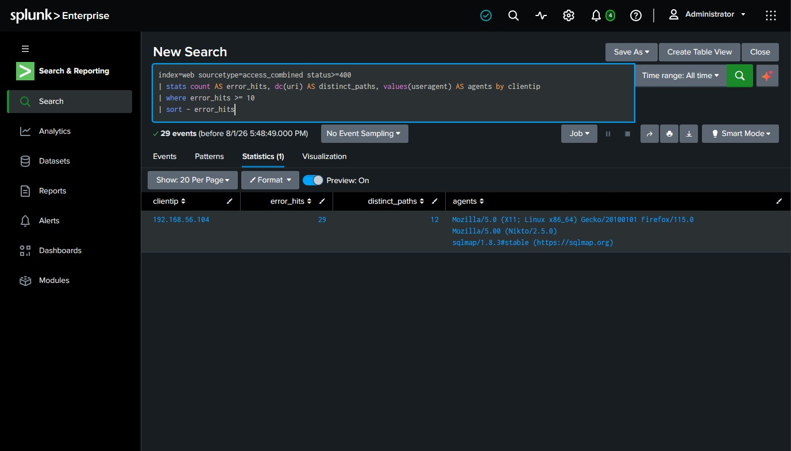
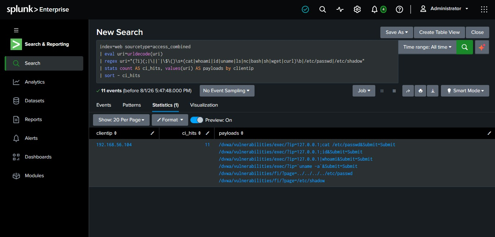
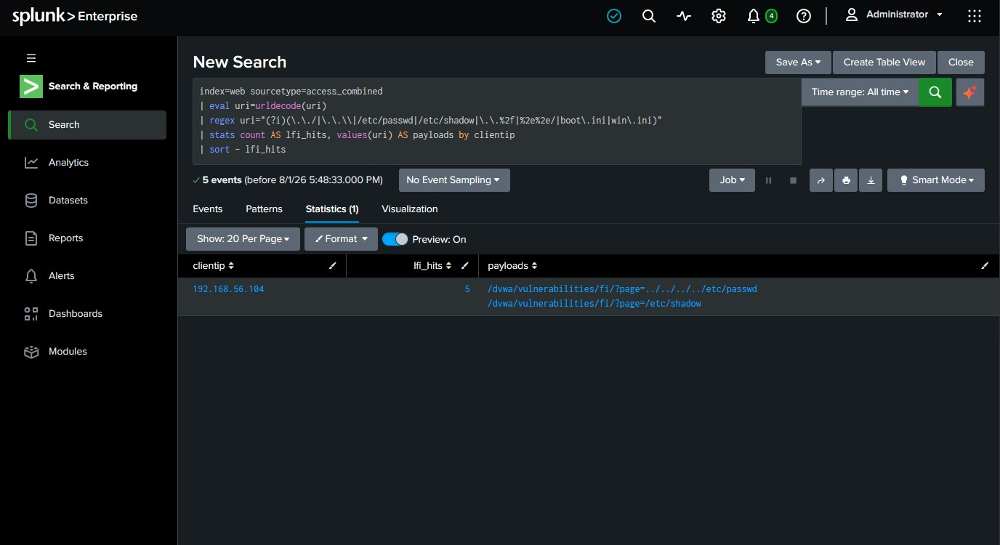
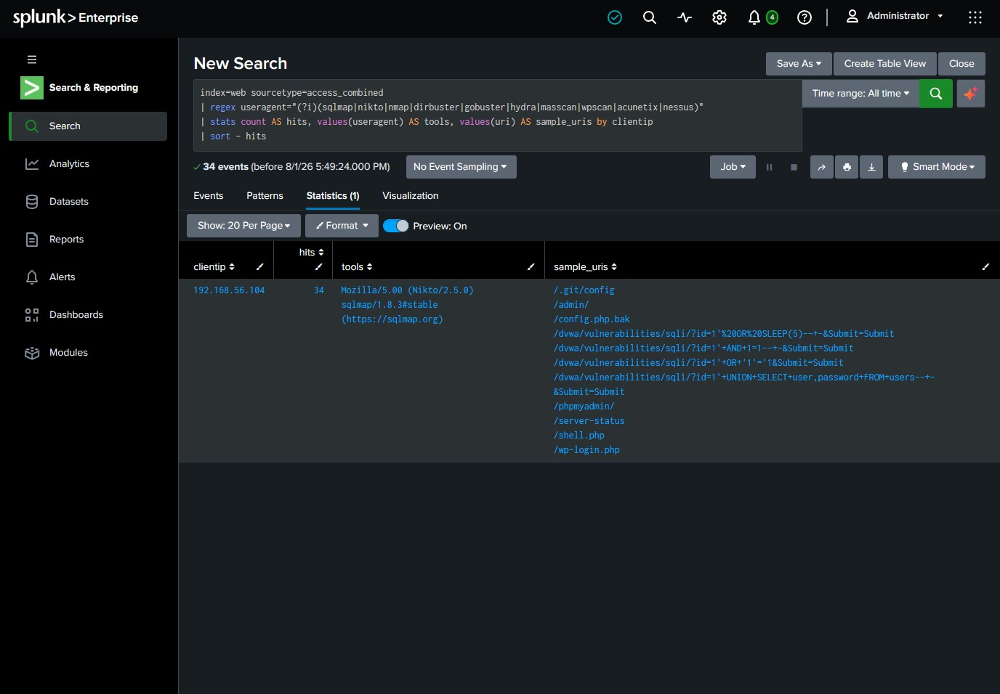
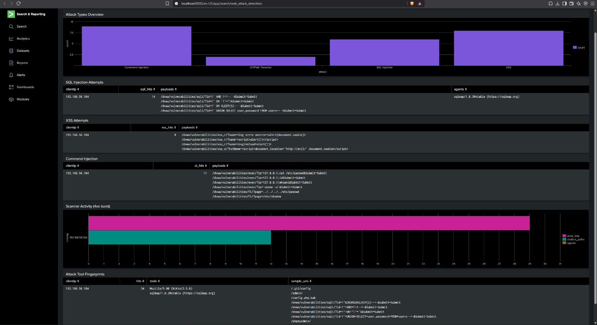
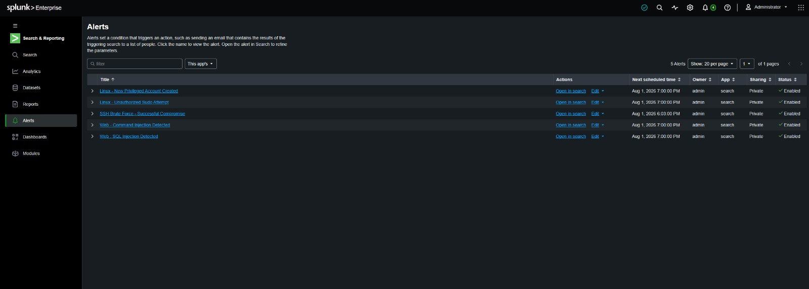
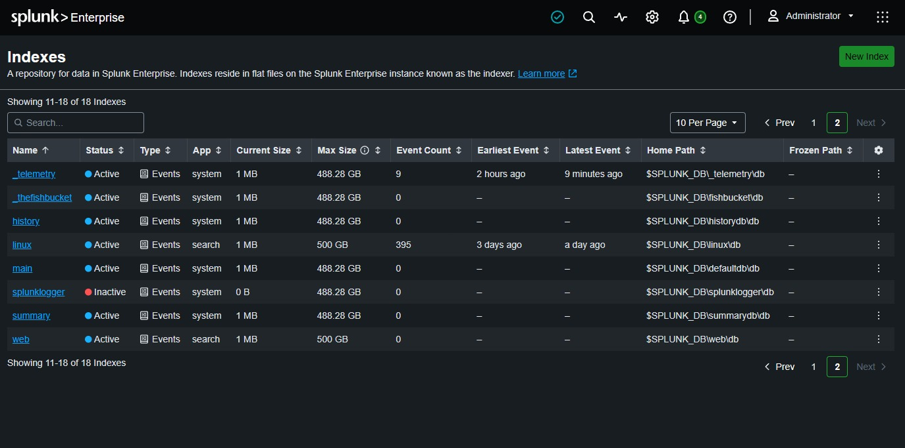
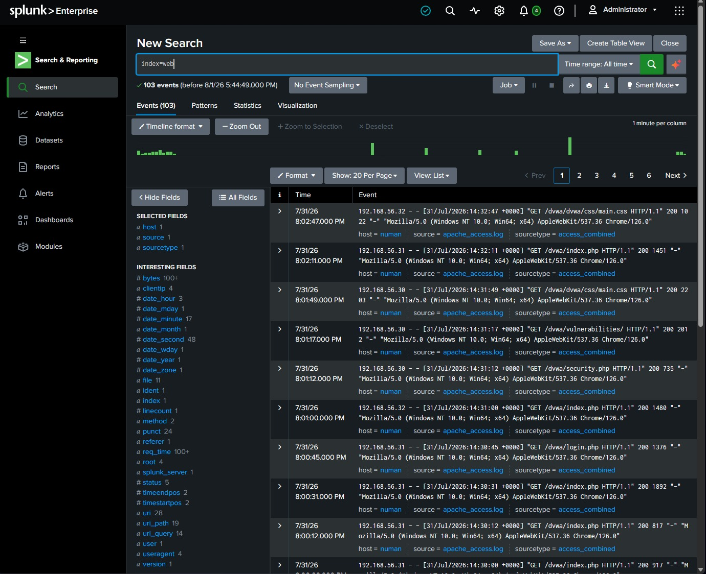
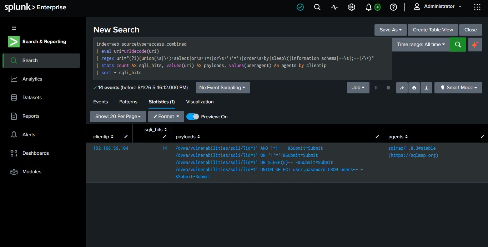
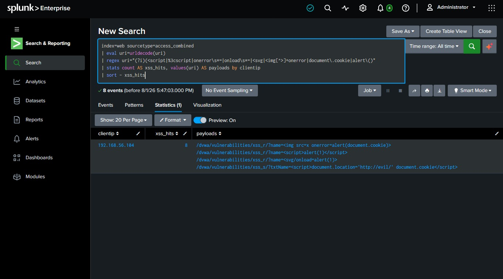

# Detection 02: Web Attack Detection (SQLi / XSS / Command Injection / Recon)

**Portfolio Project | Splunk SIEM | SOC / Incident Response**
Author: [Your Name] · Lab: Home SOC (Splunk Enterprise) · Date: 2026-07-31

> This closes the loop with your DVWA offensive work: the same vulnerabilities you exploited (SQLi, XSS, command injection, file inclusion), now seen from the **defender's** side in web server logs. Attacker-to-defender on the same target is a strong interview story.

---

## What This Project Is
Web servers log every request to an **access log** (Apache: `access.log`, format `access_combined`). Attacks against a web app leave fingerprints in the URL, `UNION SELECT`, `<script>`, `;cat /etc/passwd`, `../../etc/passwd`. This project ingests an Apache access log and writes SPL to detect those payloads, plus scanning behavior (bursts of 404s from tools like Nikto). Maps to the Deloitte role's "security investigations," "web/application attacks," and "detection rules."

**New sourcetype this project:** `access_combined` (Splunk's built-in parser for the standard Apache/NGINX combined log format). We'll use a new index, `web`, to keep it separate from your Linux data.

---

## Step 0: Create a `web` Index & Ingest the Log

### Create the index
1. **Settings → Indexes → New Index**.
2. **Index Name:** `web`, **Data Type:** Events (default). Click **Save**.

📸 **CHECKPOINT 1:** screenshot the Indexes list showing `web`.

### Upload the log
3. **Settings → Add Data → Upload** → select **`apache_access.log`** → **Next**.
4. **Set Source Type:** in the Source type dropdown, search and select **`access_combined`** (under Web). The preview on the right should split each line into fields like `clientip`, `method`, `uri`, `status`. Click **Next**.
5. **Input Settings:** set **Index = `web`**. Click **Review → Submit → Start Searching**.
6. Confirm: `index=web` with time range **All time** → ~103 events.

📸 **CHECKPOINT 2:** screenshot `index=web` returning your events.

> Why `access_combined` matters: it auto-extracts `clientip`, `method`, `uri`/`uri_path`, `status`, `useragent` for you, so your detections can reference those field names directly without writing `rex` for the basics. Confirm they exist: run `index=web | head 5` and look at the Fields sidebar on the left.

---

## Detection 2.1: SQL Injection
**Objective:** detect SQL injection payloads in request URIs.

```spl
index=web sourcetype=access_combined
| eval uri=urldecode(uri)
| regex uri="(?i)(union(\s|\+)+select|or\s+1=1|or\s+'1'='1|order\s+by|sleep\(|information_schema|--\s|;--|/\*)"
| stats count AS sqli_hits, values(uri) AS payloads, values(useragent) AS agents by clientip
| sort - sqli_hits
```
**Read it:** `urldecode` turns `%20`/`+` back into readable SQL so the pattern matches. Any IP with hits is throwing SQLi. In your data `192.168.56.104` shows `UNION SELECT ... FROM users`, `OR '1'='1`, `SLEEP(5)`, and the user-agent `sqlmap/1.8.3` is a dead giveaway it's an automated tool.
**MITRE:** T1190 Exploit Public-Facing Application.

📸 **CHECKPOINT 3:** screenshot the SQLi detection showing the attacker IP and payloads.

## Detection 2.2: Cross-Site Scripting (XSS)
**Objective:** detect script/HTML-injection payloads.

```spl
index=web sourcetype=access_combined
| eval uri=urldecode(uri)
| regex uri="(?i)(<script|%3cscript|onerror\s*=|onload\s*=|<svg|]+onerror|document\.cookie|alert\()"
| stats count AS xss_hits, values(uri) AS payloads by clientip
| sort - xss_hits
```
**Read it:** flags `<script>alert(1)</script>`, ``, cookie-stealing payloads. The stored-XSS one (`document.location='http://evil/'`) is the dangerous kind, it exfiltrates other users' cookies.
**MITRE:** T1059.007 JavaScript; T1190.

📸 **CHECKPOINT 4:** screenshot the XSS detection.

## Detection 2.3: Command Injection
**Objective:** detect OS command injection in parameters.

```spl
index=web sourcetype=access_combined
| eval uri=urldecode(uri)
| regex uri="(?i)(;|\||`|\$\()\s*(cat|whoami|id|uname|ls|nc|bash|sh|wget|curl)\b|/etc/passwd|/etc/shadow"
| stats count AS ci_hits, values(uri) AS payloads by clientip
| sort - ci_hits
```
**Read it:** catches `;cat /etc/passwd`, `|whoami`, `` `uname -a` ``. Command injection is critical, it's direct code execution on the server.
**MITRE:** T1059 Command and Scripting Interpreter; T1190.

📸 **CHECKPOINT 5:** screenshot the command-injection detection.

## Detection 2.4: Local File Inclusion / Path Traversal
**Objective:** detect attempts to read files outside the web root.

```spl
index=web sourcetype=access_combined
| eval uri=urldecode(uri)
| regex uri="(?i)(\.\./|\.\.\\|/etc/passwd|/etc/shadow|\.\.%2f|%2e%2e/|boot\.ini|win\.ini)"
| stats count AS lfi_hits, values(uri) AS payloads by clientip
| sort - lfi_hits
```
**MITRE:** T1083 File and Directory Discovery; T1190.

## Detection 2.5: Web Scanner / Recon (404 burst)
**Objective:** detect automated scanning, a single IP generating many 404/403s to paths that don't exist (Nikto, dirbuster, etc.).

```spl
index=web sourcetype=access_combined status>=400
| stats count AS error_hits, dc(uri) AS distinct_paths, values(useragent) AS agents by clientip
| where error_hits >= 10
| sort - error_hits
```
**Read it:** a real user rarely hits 10+ missing pages. An IP racking up many 404s across many distinct paths is fuzzing your app. The user-agent often names the tool (`Nikto/2.5.0`).
**MITRE:** T1595 Active Scanning; T1083.

📸 **CHECKPOINT 6:** screenshot the scanner-detection result showing the 404 burst.

## Detection 2.6: Bad User-Agents (Tool Fingerprints)
Quick, high-confidence win, attack tools announce themselves.
```spl
index=web sourcetype=access_combined
| regex useragent="(?i)(sqlmap|nikto|nmap|dirbuster|gobuster|hydra|masscan|wpscan|acunetix|nessus)"
| stats count AS hits, values(useragent) AS tools, values(uri) AS sample_uris by clientip
| sort - hits
```
**MITRE:** T1595 Active Scanning.

---

## Severity Guide
| Signal | Severity |
|---|---|
| Scanner 404 burst / recon | Low–Medium |
| Known-tool user-agent (sqlmap/Nikto) | Medium |
| SQLi / XSS / LFI attempts | Medium–High |
| Command injection (RCE) | High–Critical |
| Any attack with HTTP 200 + large response = likely successful | Critical |

> Pro triage note: a SQLi request returning **200 with an unusually large response** may mean data was actually returned to the attacker (successful extraction). A **500** often means the injection broke the query (attempt, maybe unsuccessful). Look at `status` and response size, not just the payload.

## Triage Steps
1. Identify the source IP and confirm it's an attack (payload + tool UA = high confidence).
2. Determine which attack types that IP attempted (run all detections, or pivot: `index=web clientip="192.168.56.104"`).
3. Assess success: HTTP status codes and response sizes for the malicious requests. 200 + big = worry.
4. Identify the targeted endpoint (`/sqli/`, `/exec/`) and its exposure.

## Investigation
- Pull the full request timeline for the attacker IP in order: `index=web clientip="192.168.56.104" | eval uri=urldecode(uri) | table _time, method, uri, status | sort _time`.
- Correlate with server-side logs (the Linux `auth.log` from Projects #1/#3): did web exploitation lead to a shell / new user? (Command injection → the `svc-backup` creation you detected earlier would be the smoking gun of a full kill chain.)
- Check whether any malicious request returned 200 with data.

## Containment
- Block the attacker IP at the WAF/firewall.
- Take the vulnerable endpoint offline or put it behind auth if actively exploited.
- If command injection succeeded, treat the host as compromised → IR on the server (check for webshells, new users, cron, outbound connections).
- Preserve access logs as evidence.

## Recommendations
- Deploy a **WAF** (ModSecurity + OWASP CRS) in front of the app.
- Fix the root cause: parameterized queries (SQLi), output encoding + CSP (XSS), input allowlisting / avoid shell calls (command injection), no user input in file paths (LFI).
- Rate-limit and block on repeated 4xx to slow scanners.
- Alert on known-tool user-agents and on any command-injection signature.

---

## Building the Dashboard: Step by Step

Make a dashboard `Web Attack Detection` with 6 panels. **Panel 1 = New dashboard; Panels 2–6 = Existing.**

Recipe (same every time): Search tab → paste query → time picker **All time** → run → **Statistics** tab (tables) or **Visualization** tab (charts) → **Save As → Dashboard Panel** → New/Existing → Panel Title → Save.

1. **Attack Types Overview** · **NEW** dashboard (`Web Attack Detection`, Classic) · **Visualization → Column Chart**
   ```
   index=web sourcetype=access_combined
   | eval uri=urldecode(uri)
   | eval attack=case(
       match(uri,"(?i)union\s+select|or\s+1=1|sleep\(|information_schema"),"SQL Injection",
       match(uri,"(?i)<script|onerror=|onload=|<svg|document\.cookie"),"XSS",
       match(uri,"(?i)(;|\||`)\s*(cat|whoami|id|uname)|/etc/passwd"),"Command Injection",
       match(uri,"(?i)\.\./|/etc/shadow"),"LFI/Path Traversal",
       true(),"Other/Benign")
   | search attack!="Other/Benign"
   | stats count by attack
   ```
   Panel Title = `Attack Types Overview`.

2. **SQL Injection by Source IP** · **EXISTING** · **Statistics** tab → use Detection **2.1** query. Panel Title = `SQL Injection Attempts`.
3. **XSS Attempts** · **EXISTING** · **Statistics** → Detection **2.2**. Panel Title = `XSS Attempts`.
4. **Command Injection** · **EXISTING** · **Statistics** → Detection **2.3**. Panel Title = `Command Injection (RCE)`.
5. **Web Scanner / 404 Burst** · **EXISTING** · **Visualization → Bar Chart** → Detection **2.5**. Panel Title = `Scanner Activity (4xx burst)`.
6. **Malicious Tool User-Agents** · **EXISTING** · **Statistics** → Detection **2.6**. Panel Title = `Attack Tool Fingerprints`.

📸 **CHECKPOINT 7:** screenshot the full `Web Attack Detection` dashboard with all 6 panels populated.

---

## Saving the Alerts: Step by Step

Two alerts. For each: Search tab → paste query → run → **Save As → Alert** → fill the window top to bottom → Save.

### Alert 1: Command Injection (highest priority)
1. Paste Detection **2.3** query, time **All time**, run it.
2. **Save As → Alert.**
3. Settings:
   - **Title:** `Web - Command Injection Detected`
   - **Alert type:** **Scheduled** → **Run every hour**
   - **Trigger alert when:** **Number of Results** → **is Greater than** → `0`
   - **Trigger Actions:** **+ Add Actions → Add to Triggered Alerts** → **Severity: Critical**
4. **Save.**

### Alert 2: SQL Injection
Same steps with Detection **2.1** query:
- **Title:** `Web - SQL Injection Detected`
- Scheduled, Run every hour, Number of Results > 0
- Add to Triggered Alerts, **Severity: High**

**Where to find them:** Search & Reporting → **Alerts** tab. Fired alerts: top bar → **Activity → Triggered Alerts**.

📸 **CHECKPOINT 8:** screenshot both alert configs and the Alerts tab listing them.

---

## Resume Bullet
> Built web-application attack detection in Splunk over Apache `access_combined` logs, writing SPL (with URL decoding and regex) to detect SQL injection, XSS, command injection, path traversal, and automated scanning, and to fingerprint attack tools by user-agent; correlated web exploitation with host auth logs to trace a full kill chain, visualized findings in a dashboard, and deployed scheduled alerts mapped to MITRE ATT&CK T1190, T1059, and T1595.

## Interview Explanation
> "I ingested Apache access logs as `access_combined`, which auto-extracts fields like clientip, uri, and status. Web attacks leave signatures in the URL, so I URL-decode the request and regex for patterns: `UNION SELECT` and `OR 1=1` for SQLi, `<script>` and `onerror=` for XSS, shell metacharacters with `cat`/`whoami` for command injection, and `../` for path traversal. I also detect scanners by flagging any IP with a burst of 4xx errors across many paths, and I fingerprint tools by user-agent, sqlmap and Nikto literally name themselves. The part I like most is triage on success: a SQLi returning HTTP 200 with a large response likely means data was actually extracted, versus a 500 that just broke the query. And because I also monitor the host's auth logs, I can correlate, if command injection is followed by a new root user appearing, that's a confirmed full compromise, not just an attempt. Mapped to MITRE T1190 for the exploitation and T1595 for the recon."

## Evidence Checklist
- [ ] `web` index created
- [ ] `apache_access.log` ingested as access_combined
- [ ] SQLi detection (attacker IP + sqlmap UA)
- [ ] XSS detection
- [ ] Command injection detection
- [ ] Scanner / 404 burst detection
- [ ] Tool user-agent detection
- [ ] Dashboard populated
- [ ] Both alerts saved


---

## Evidence (Splunk screenshots)
> Detections were built and proven against sample log data; the SSH attack is additionally reproduced live with Hydra (see `02_Hydra_Live_Attack_Reproduction.md`).




















