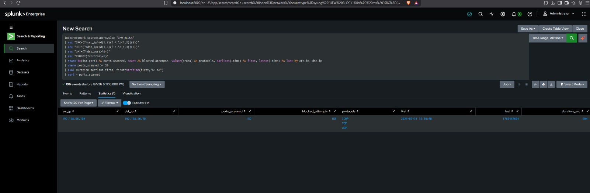
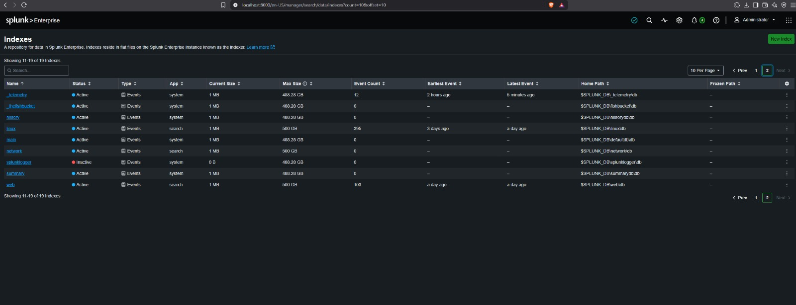
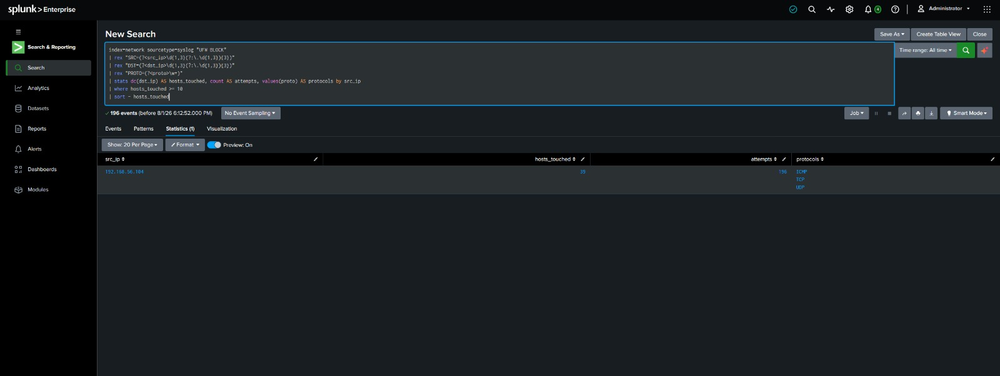
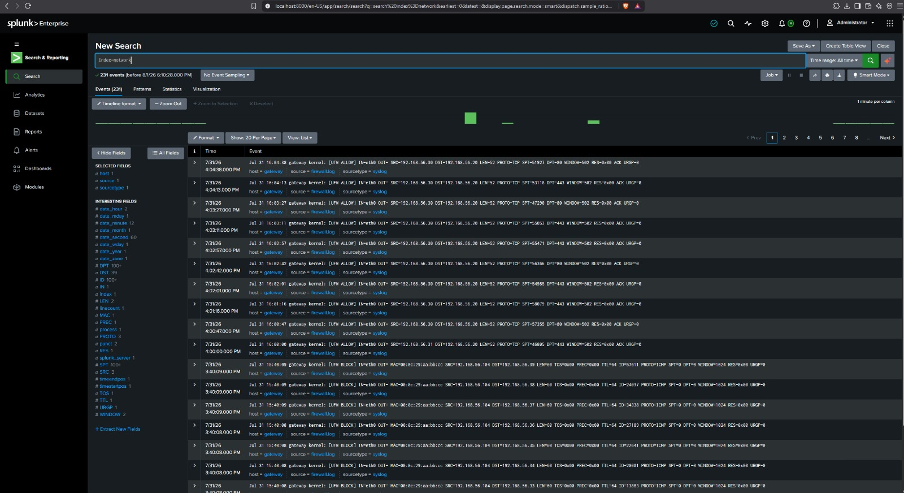
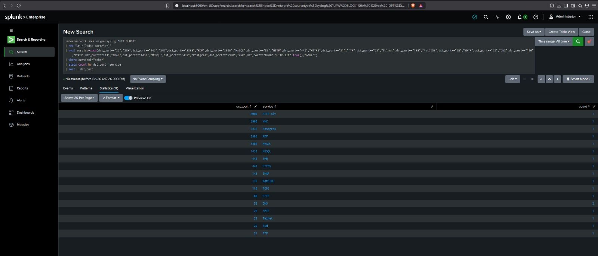
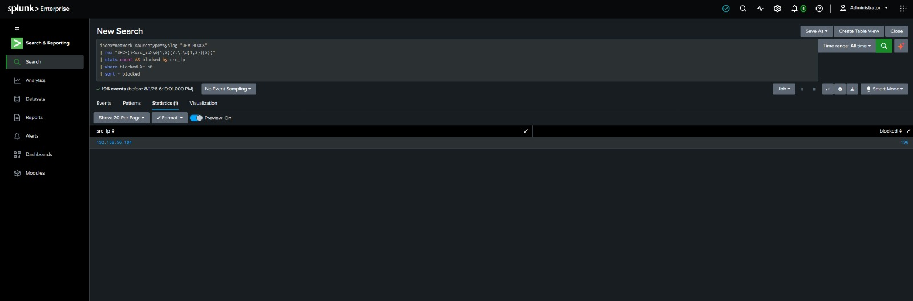
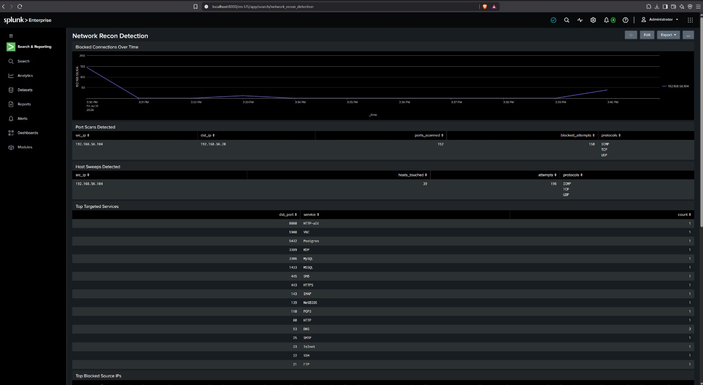
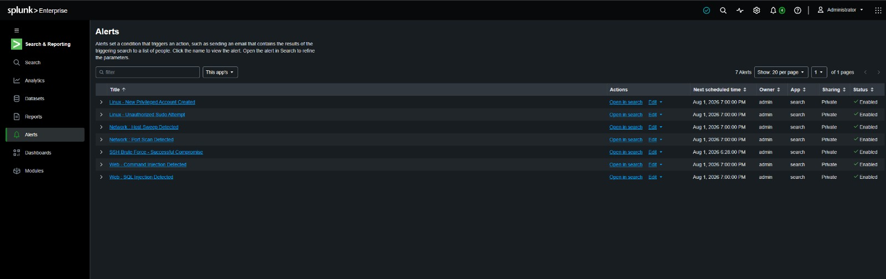

# Detection 04: Network Recon Detection (Port Scans / Sweeps / Enumeration)

**Portfolio Project | Splunk SIEM | SOC / Incident Response**
Author: [Your Name] · Lab: Home SOC (Splunk Enterprise) · Date: 2026-07-31

> Recon is the **first phase** of almost every attack, before exploiting anything, an attacker maps what's there (Nmap port scans, ping sweeps, service enumeration). Catching recon early means catching attacks before they land. This completes your 4-project portfolio and demonstrates detection across the full kill chain: recon → exploitation → credential access → persistence.

---

## What This Project Is
A firewall logs every connection it allows or blocks. A port scan looks unmistakable in those logs: **one source IP hitting many different destination ports in a short time**, mostly getting blocked. A ping sweep is **one source touching many different destination hosts**. This project ingests a UFW/iptables firewall log and writes SPL to detect both, plus tool fingerprinting. Maps to the Deloitte role's "security investigations," "detection rules," and MITRE ATT&CK Reconnaissance.

**Data source:** UFW/iptables kernel log lines (from `/var/log/syslog` or `/var/log/ufw.log`).
**Sourcetype:** `syslog` (generic, the firewall fields aren't auto-parsed, so we extract `SRC`, `DST`, `DPT`, `PROTO` ourselves with `rex`; good `rex` practice for interviews).
**New index:** `network`.

---

## Step 0: Create a `network` Index & Ingest the Log

### Create the index
1. **Settings → Indexes → New Index** → **Index Name:** `network`, Data Type: Events → **Save**.

📸 **CHECKPOINT 1:** screenshot the Indexes list showing `network`.

### Upload the log
2. **Settings → Add Data → Upload** → select **`firewall.log`** → **Next**.
3. **Set Source Type:** choose **`syslog`** (under Operating System). The preview should show one event per line with a proper timestamp. Click **Next**.
4. **Input Settings:** **Index = `network`** → **Review → Submit → Start Searching**.
5. Confirm: `index=network` with time range **All time** → ~231 events.

📸 **CHECKPOINT 2:** screenshot `index=network` returning your events.

> Because `syslog` doesn't auto-extract firewall fields, every detection below starts by pulling them out with one `rex` line. Learn this pattern, it's the same `rex ... (?<field>...)` you used on `auth.log`, just different fields.

---

## Detection 4.1: Port Scan (one source → many ports)
**Objective:** detect a horizontal port scan, a single source IP probing many distinct ports on a host.

```spl
index=network sourcetype=syslog "UFW BLOCK"
| rex "SRC=(?<src_ip>\d{1,3}(?:\.\d{1,3}){3})"
| rex "DST=(?<dst_ip>\d{1,3}(?:\.\d{1,3}){3})"
| rex "DPT=(?<dst_port>\d+)"
| rex "PROTO=(?<proto>\w+)"
| stats dc(dst_port) AS ports_scanned, count AS blocked_attempts, values(proto) AS protocols, earliest(_time) AS first, latest(_time) AS last by src_ip, dst_ip
| where ports_scanned >= 20
| eval duration_sec=last-first, first=strftime(first,"%F %T")
| sort - ports_scanned
```
**Read it:** `dc(dst_port)` = distinct ports touched. 20+ distinct ports from one IP to one host in a short window is a scan, not normal traffic. In your data, `192.168.56.104` → `192.168.56.20` shows ~150 ports in seconds. `duration_sec` being tiny confirms it's automated (Nmap), not a human.
**MITRE:** T1046 Network Service Discovery; T1595.001 Scanning IP Blocks.

📸 **CHECKPOINT 3:** screenshot the port-scan detection showing ~150 ports from the attacker IP.

## Detection 4.2: Ping Sweep / Host Discovery (one source → many hosts)
**Objective:** detect horizontal host discovery, one source touching many different destination IPs (mapping the subnet).

```spl
index=network sourcetype=syslog "UFW BLOCK"
| rex "SRC=(?<src_ip>\d{1,3}(?:\.\d{1,3}){3})"
| rex "DST=(?<dst_ip>\d{1,3}(?:\.\d{1,3}){3})"
| rex "PROTO=(?<proto>\w+)"
| stats dc(dst_ip) AS hosts_touched, count AS attempts, values(proto) AS protocols by src_ip
| where hosts_touched >= 10
| sort - hosts_touched
```
**Read it:** one IP reaching 10+ different hosts = subnet sweep. Your attacker pings 39 hosts across `192.168.56.0/24` via ICMP. `protocols=ICMP` tells you it's a ping sweep specifically.
**MITRE:** T1018 Remote System Discovery; T1595.

📸 **CHECKPOINT 4:** screenshot the ping-sweep detection.

## Detection 4.3: Scan Timeline (visualize the burst)
**Objective:** show the recon as a spike in blocked connections over time, the visual signature.

```spl
index=network sourcetype=syslog "UFW BLOCK"
| rex "SRC=(?<src_ip>\d{1,3}(?:\.\d{1,3}){3})"
| timechart span=1m count AS blocked_connections by src_ip
```
**Read it:** a flat baseline that suddenly spikes to hundreds of blocks in one minute = the scan. Great for the dashboard.

## Detection 4.4: Top Targeted Ports
**Objective:** see which services the attacker is most interested in (helps predict their next move).

```spl
index=network sourcetype=syslog "UFW BLOCK"
| rex "DPT=(?<dst_port>\d+)"
| eval service=case(dst_port=="22","SSH",dst_port=="445","SMB",dst_port=="3389","RDP",dst_port=="3306","MySQL",dst_port=="80","HTTP",dst_port=="443","HTTPS",dst_port=="21","FTP",dst_port=="23","Telnet",dst_port=="139","NetBIOS",dst_port=="25","SMTP",dst_port=="53","DNS",dst_port=="110","POP3",dst_port=="143","IMAP",dst_port=="1433","MSSQL",dst_port=="5432","Postgres",dst_port=="5900","VNC",dst_port=="8080","HTTP-alt",true(),"other")
| where service!="other"
| stats count by dst_port, service
| sort - dst_port
```
**Read it:** high-value ports (445/SMB, 3389/RDP, 22/SSH) being probed tells you what the attacker will try to exploit or brute-force next, e.g. SMB probing often precedes enum4linux / EternalBlue attempts.

> **Why `where service!="other"`?** A port scan hits *every* port, including hundreds of uninteresting ones (and the ICMP sweep shows as port 0). If you `sort - count` and `head 20` without filtering, those drown out the named services (which each appear once). Filtering to recognized services surfaces exactly the ones a SOC analyst cares about.

**MITRE:** T1046.

📸 **CHECKPOINT 5:** screenshot the top-targeted-ports result.

## Detection 4.5: Blocked-Connection Volume by Source (quick offender list)
```spl
index=network sourcetype=syslog "UFW BLOCK"
| rex "SRC=(?<src_ip>\d{1,3}(?:\.\d{1,3}){3})"
| stats count AS blocked by src_ip
| where blocked >= 50
| sort - blocked
```
**Read it:** any IP with 50+ blocked connections is almost certainly hostile, a fast triage panel.
**MITRE:** T1595.

📸 **CHECKPOINT 6:** screenshot this offender list.

> **Note on Nikto / web enumeration:** app-layer recon (Nikto, dirbuster) shows up in *web* logs, not firewall logs, you already built that detection in Project #2 (Scanner 404-burst + tool user-agents). Mention in interviews that recon spans layers: network-layer scans in firewall logs, application-layer scans in web logs. Detecting both = full recon coverage.

---

## Severity Guide
| Signal | Severity |
|---|---|
| Small number of blocked connections (noise) | Informational |
| Port scan (20+ ports, one host) | Medium |
| Subnet sweep (10+ hosts) | Medium |
| Scan targeting sensitive ports (SMB/RDP/SSH) | Medium–High |
| Scan **followed by** connection to an open port + exploit/auth attempt | High |

## Triage Steps
1. Confirm it's a scan: high `dc(dst_port)` or `dc(dst_ip)` from one source over a short duration = automated recon.
2. Internal or external source? Internal scanning source may be a compromised host pivoting, treat seriously.
3. What did they focus on? (Detection 4.4, SMB/RDP/SSH focus predicts the next step.)
4. Did recon lead anywhere? Pivot to your other data: did this same IP then appear in `auth.log` (SSH brute force, Projects #1/#3) or web logs (Project #2)?

## Investigation
- Full activity for the source IP: `index=network src_ip="192.168.56.104" | rex "DPT=(?<dst_port>\d+)" | table _time, dst_ip, dst_port, proto | sort _time`.
- Cross-index correlation (the powerful part): `(index=network OR index=linux OR index=web) 192.168.56.104`: one search across all three data sources shows the attacker's full story: scan → brute force → web exploit.
- Determine if any scanned port was actually open/reachable (ALLOW events, or successful sessions in other logs).

## Containment
- Block the source IP at the perimeter firewall.
- If the source is internal, isolate that host: it may be compromised and pivoting.
- Confirm no follow-on successful access from that IP in your other indexes.
- Preserve firewall logs.

## Recommendations
- Rate-limit / auto-block scanning sources (fail2ban `recidive`, firewall threshold rules).
- Minimize attack surface: close unused ports, segment the network so a scan can't see everything.
- Deploy IDS (Suricata/Zeek) for richer scan detection and alerting.
- Centralize firewall logs into the SIEM (you just did) and alert on scan thresholds.

---

## Building the Dashboard: Step by Step

Make a dashboard `Network Recon Detection` with 6 panels. **Panel 1 = New; Panels 2–6 = Existing.**
Recipe: Search tab → paste query → time **All time** → run → **Statistics** tab (tables) or **Visualization** tab (charts) → **Save As → Dashboard Panel** → New/Existing → Panel Title → Save.

### Panel 1: "Blocked Connections Over Time" · **NEW** (`Network Recon Detection`, Classic) · **Visualization → Line Chart**
```
index=network sourcetype=syslog "UFW BLOCK"
| rex "SRC=(?<src_ip>\d{1,3}(?:\.\d{1,3}){3})"
| timechart span=1m count AS blocked_connections by src_ip
```

### Panel 2: "Port Scans Detected" · **EXISTING** · **Statistics** tab (table)
```
index=network sourcetype=syslog "UFW BLOCK"
| rex "SRC=(?<src_ip>\d{1,3}(?:\.\d{1,3}){3})"
| rex "DST=(?<dst_ip>\d{1,3}(?:\.\d{1,3}){3})"
| rex "DPT=(?<dst_port>\d+)"
| rex "PROTO=(?<proto>\w+)"
| stats dc(dst_port) AS ports_scanned, count AS blocked_attempts, values(proto) AS protocols by src_ip, dst_ip
| where ports_scanned >= 20
| sort - ports_scanned
```

### Panel 3: "Host Sweeps Detected" · **EXISTING** · **Statistics** tab (table)
```
index=network sourcetype=syslog "UFW BLOCK"
| rex "SRC=(?<src_ip>\d{1,3}(?:\.\d{1,3}){3})"
| rex "DST=(?<dst_ip>\d{1,3}(?:\.\d{1,3}){3})"
| rex "PROTO=(?<proto>\w+)"
| stats dc(dst_ip) AS hosts_touched, count AS attempts, values(proto) AS protocols by src_ip
| where hosts_touched >= 10
| sort - hosts_touched
```

### Panel 4: "Top Targeted Services" · **EXISTING** · **Statistics** tab (table)
Filters to recognized services so the high-value ports (SSH/SMB/RDP) are visible instead of being buried under the hundreds of scanned ports.
```
index=network sourcetype=syslog "UFW BLOCK"
| rex "DPT=(?<dst_port>\d+)"
| eval service=case(dst_port=="22","SSH",dst_port=="445","SMB",dst_port=="3389","RDP",dst_port=="3306","MySQL",dst_port=="80","HTTP",dst_port=="443","HTTPS",dst_port=="21","FTP",dst_port=="23","Telnet",dst_port=="139","NetBIOS",dst_port=="25","SMTP",dst_port=="53","DNS",dst_port=="110","POP3",dst_port=="143","IMAP",dst_port=="1433","MSSQL",dst_port=="5432","Postgres",dst_port=="5900","VNC",dst_port=="8080","HTTP-alt",true(),"other")
| where service!="other"
| stats count by dst_port, service
| sort - dst_port
```

### Panel 5: "Top Blocked Source IPs" · **EXISTING** · **Visualization → Bar Chart**
```
index=network sourcetype=syslog "UFW BLOCK"
| rex "SRC=(?<src_ip>\d{1,3}(?:\.\d{1,3}){3})"
| stats count AS blocked by src_ip
| sort - blocked
| head 10
```

### Panel 6: "Scan Detail, Attacker Timeline" · **EXISTING** · **Statistics** tab (table)
```
index=network sourcetype=syslog "UFW BLOCK"
| rex "SRC=(?<src_ip>\d{1,3}(?:\.\d{1,3}){3})"
| rex "DST=(?<dst_ip>\d{1,3}(?:\.\d{1,3}){3})"
| rex "DPT=(?<dst_port>\d+)"
| rex "PROTO=(?<proto>\w+)"
| search src_ip="192.168.56.104"
| table _time, src_ip, dst_ip, dst_port, proto
| sort _time
```

📸 **CHECKPOINT 7:** screenshot the full `Network Recon Detection` dashboard with all 6 panels populated.

---

## Saving the Alerts: Step by Step

Two alerts. For each: Search tab → paste query → run → **Save As → Alert** → fill top to bottom → Save.

### Alert 1: Port Scan Detected
1. Paste this, time **All time**, run it:
   ```
   index=network sourcetype=syslog "UFW BLOCK"
   | rex "SRC=(?<src_ip>\d{1,3}(?:\.\d{1,3}){3})"
   | rex "DST=(?<dst_ip>\d{1,3}(?:\.\d{1,3}){3})"
   | rex "DPT=(?<dst_port>\d+)"
   | stats dc(dst_port) AS ports_scanned by src_ip, dst_ip
   | where ports_scanned >= 20
   ```
2. **Save As → Alert.**
3. Settings:
   - **Title:** `Network - Port Scan Detected`
   - **Alert type:** **Scheduled → Run every hour**
   - **Trigger alert when:** **Number of Results** → **is Greater than** → `0`
   - **Trigger Actions:** **+ Add Actions → Add to Triggered Alerts** → **Severity: Medium**
4. **Save.**

### Alert 2: Host Sweep Detected
Same steps with this query:
```
index=network sourcetype=syslog "UFW BLOCK"
| rex "SRC=(?<src_ip>\d{1,3}(?:\.\d{1,3}){3})"
| rex "DST=(?<dst_ip>\d{1,3}(?:\.\d{1,3}){3})"
| stats dc(dst_ip) AS hosts_touched by src_ip
| where hosts_touched >= 10
```
- **Title:** `Network - Host Sweep Detected`
- Scheduled, Run every hour, Number of Results > 0
- Add to Triggered Alerts, **Severity: Medium**

**Where to find them:** Search & Reporting → **Alerts** tab. Fired: top bar → **Activity → Triggered Alerts**.

📸 **CHECKPOINT 8:** screenshot both alert configs and the Alerts tab listing them.

---

## The Big Payoff: Cross-Index Correlation (do this, it's your best interview moment)
You now have four data sources in Splunk: `network` (firewall), `linux` (auth), `web` (Apache). Run one search across all of them for the attacker:
```
(index=network OR index=linux OR index=web) "192.168.56.104"
| sort _time
```
This shows the attacker's **entire kill chain in one timeline**: port scan → SSH brute force → web exploitation. Being able to say *"I correlated recon, credential access, and exploitation across three data sources to reconstruct the full attack"* is exactly the senior-analyst capability the Deloitte IR role wants.

📸 **BONUS SCREENSHOT:** capture this cross-index timeline, it's the strongest single artifact in your whole portfolio.

---

## Resume Bullet
> Built network reconnaissance detection in Splunk over firewall (UFW/iptables) logs, using SPL field extraction and distinct-count thresholds to detect Nmap port scans, subnet ping sweeps, and service-targeting, then correlated recon across firewall, host auth, and web logs to reconstruct a complete attacker kill chain, mapped to MITRE ATT&CK T1046, T1018, and T1595.

## Interview Explanation
> "Recon is the first phase of an attack, so detecting it buys you time. I ingested firewall logs and extracted source, destination, and port with rex. A port scan is one source hitting many distinct destination ports in a short window, so I count distinct ports per source-destination pair and threshold it, in my lab the attacker touched 150 ports in seconds, which is obviously automated, not human. A ping sweep is the same idea but distinct destination *hosts*. I also break down the top targeted ports, because heavy SMB or RDP probing predicts the next move. The capstone is cross-index correlation: I have firewall, auth, and web logs all in Splunk, so I can search one attacker IP across all three and see the full chain, scan, then SSH brute force, then web exploitation, in a single timeline. That's the difference between an alert and an actual investigation."

## Evidence Checklist
- [ ] `network` index created
- [ ] `firewall.log` ingested as syslog
- [ ] Port-scan detection (~150 ports from attacker)
- [ ] Host-sweep detection (39 hosts)
- [ ] Top targeted ports
- [ ] Top blocked source IPs
- [ ] Dashboard populated
- [ ] Both alerts saved
- [ ] Cross-index kill-chain correlation search


---

## Evidence (Splunk screenshots)
> Detections were built and proven against sample log data; the SSH attack is additionally reproduced live with Hydra (see `02_Hydra_Live_Attack_Reproduction.md`).
















